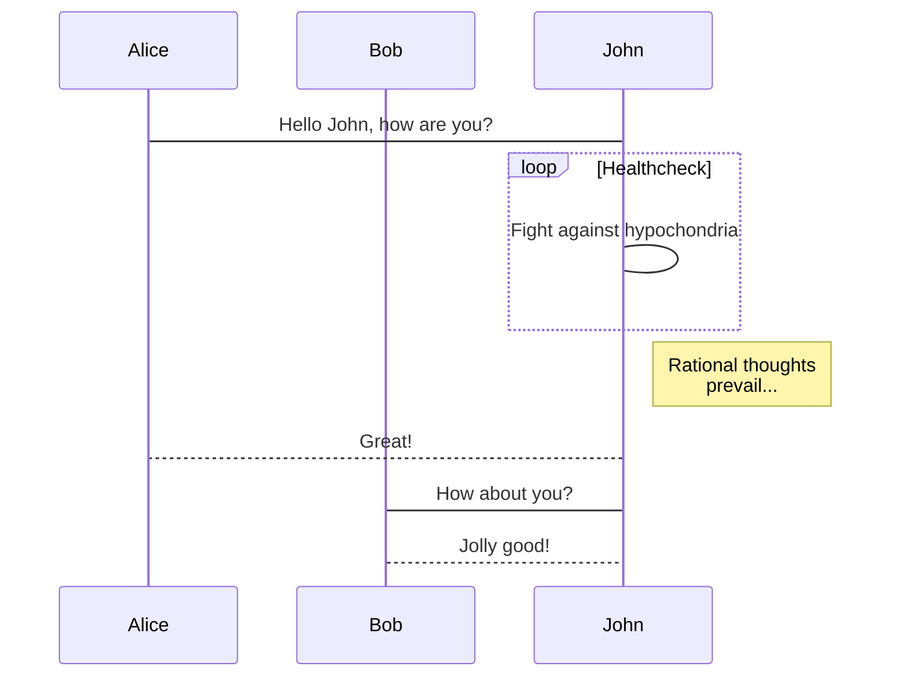

## docsify

> A magical documentation site generator.

## What it is

docsify generates your documentation website on the fly. Unlike GitBook, it does not generate static html files. Instead, it smartly loads and parses your Markdown files and displays them as a website. To start using it, all you need to do is create an `index.html` and [deploy it on GitHub Pages](deploy.md).

See the [Quick start](quickstart.md) guide for more details.

## Features

- No statically built html files
- Simple and lightweight (~21kB gzipped)
- Smart full-text search plugin
- Multiple themes
- Useful plugin API
- Emoji support
- Compatible with IE10+
- Support server-side rendering ([example](https://github.com/docsifyjs/docsify-ssr-demo))

## Examples

Check out the [Showcase](https://github.com/docsifyjs/docsify/#showcase) to see docsify in use.

## Donate

Please consider donating if you think docsify is helpful to you or that my work is valuable. I am happy if you can help me [buy a cup of coffee](https://github.com/QingWei-Li/donate). :heart:

## Community

Users and the development team are usually in the [Gitter chat room](https://gitter.im/docsifyjs/Lobby).

# mermaid



# Vue guide

{docsify-updated}

`v-for` usage.

```html
<ul>
  <li v-for="i in 10">{{ i }}</li>
</ul>
```

<ul>
  <li v-for="i in 10">{{ i }}</li>
</ul>

# Vue demo

<div id="main2">hello {{ msg }}</div>

<script>
  new Vue({
    el: '#main2',
    data: { msg: 'Vue' }
  })
</script>
