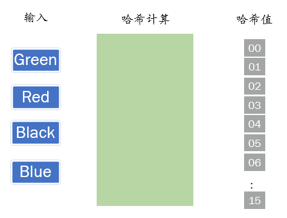
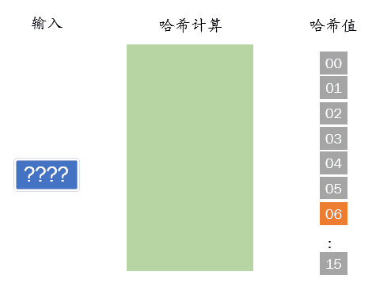
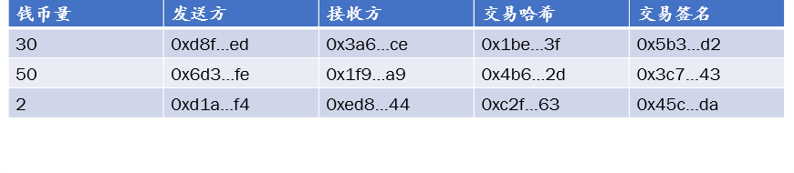
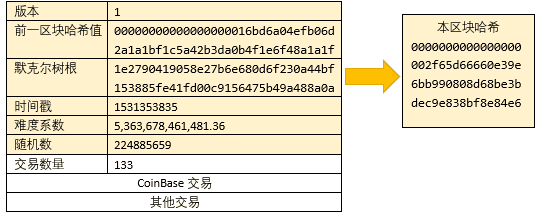
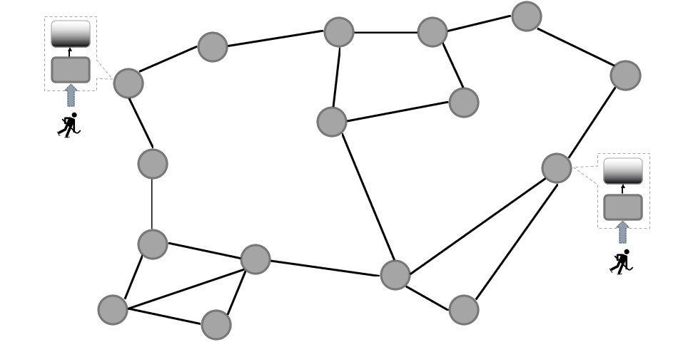
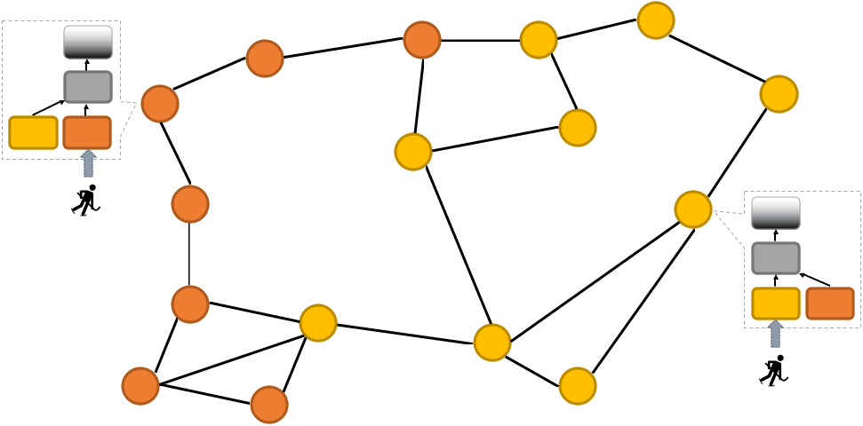

# 区块链系统概述

狭义来讲，区块链是一种按照时间顺序将数据区块以顺序相连的方式组合成的一种链式数据结构，
并以密码学方式保证的不可篡改和不可伪造的分布式账本。

广义来讲，区块链技术是利用块链式数据结构来验证与存储数据、利用分布式节点共识算法来生成和更新数据、
利用密码学的方式保证数据传输和访问的安全、
利用由自动化脚本代码组成的智能合约来编程和操作数据的一种全新的分布式基础架构与计算方式。

以下几节分别从密码学、区块链的链状结构、分布式网络、轻量客户端和智能合约方面对区块链系统做概念上的阐述。

本章内容并没有打算深入到每一个细节，只是希望能给读者以区块链的全局观，
方便后续做程序实现的时候，可以更加明白自己正在做的是区块链的哪个部分，
而技术细节和一些关于细节方面的疑问都会在后续的具体代码实现的章节中得到解答。

## 用密码学保护区块

### 哈希计算

密码学上的`哈希`算法一般需要具有以下的性质：

- 函数的输入可以是任意长的字符串；
- 函数的输出是固定长度的；
- 函数的计算过程应该是高效的。

哈希计算，即通过一个算法将任意一段输入字符串计算出一个固定长度的数值。
通过哈希算法计算出的结果，是无法再通过任何算法还原出原始数据的。
即哈希计算是单向的，因此可以用于判断数据的完整性，哪怕再小的一点数据变化，
都会导致重新计算的哈希结果与之前的结果会大不一样。

如下图所示，无论原始内容改动是多么的小，或者变化多么的大，其通过哈希函数后的输出都会非常的不一样。

哈希函数有以下三个安全特性

* 抗碰撞性
* 不可逆性
* 不可解性

（点开以下动图详细了解这三个安全特性）

<!-- tabs:start -->

#### ** 抗碰撞性 **

由于哈希算法的输出值是固定长度的，而原始数据的长度却是任意，
在理论上存在不同的原始数据对应同一哈希值的可能，如上图所示情况。
这种情况在原始数据的数量极其庞大的时候就会出现。然而由于哈希计算的抗碰撞性，
即找到有冲突的两个输入的代价非常大，所以人为的想要持续找到两个冲突的哈希值的可能性接近于零。

该安全特性的典型应用——信息摘要：在比较两条信息时，若两条信息的哈希值相同，
便可以认为两条信息是相同的，而通常情况下哈希值比原信息更加短小，也就更加方便。

#### ** 不可逆性 **

当我们不知道输入值的时候，通过某一个哈希值是非常难于逆推导出原始的输入。

该安全特性的典型应用——密码存储：在服务器上只需要存储密码哈希值，
而用户的登陆过程仅对比哈希值，因此仅有用户知道密码原文，服务器不会成为泄漏密码的源头。

#### ** 不可解性 **

我们无法构造出一个输入，使其正好等于某个哈希值。

该安全特性的典型应用——公正解谜：解谜活动的主办者，可以先公布答案的哈希值，
而并不公布答案本身，到揭晓答案的时间后，再公布原始答案，由于哈希函数的不可解性，
由于已经公布了答案的哈希值，主办方即便不公布答案原文也不可能更改答案。

<!-- tabs:end -->

---

> #### 扩展知识
>   
> 密码学中常用的哈希算法有MD5、SHA1、SHA2、SHA256、SHA512、SHA3、RIPEMD160，下面简单介绍一下。
>  
> - MD5（Message Digest Algorithm5）。
>   MD5是输入不定长度信息，输出固定长度128bits的算法。
>   经过程序流程，生成4个32位数据，最后联合起来成为一个128bits哈希。
>   基本方式为求余、取余、调整长度、与链接变量进行循环运算，
>   得出结果。MD5算法曾被广泛使用，然而目前该算法已被证明是一种不安全的算法。
> 
> - SHA1（Secure Hash Algorithm 1）。
>   SHA1在许多安全协议中广为使用，包括TLS和SSL。
>   2017年2月，Google宣布已攻破了SHA1，并准备在其Chrome浏览器产品中逐渐降低SHA1证书的安全指数，
>   逐步停止对使用SHA1哈希算法证书的支持。
> 
> - SHA2。
>   这是SHA算法家族的第二代，支持了更长的摘要信息输出，
>   主要有SHA224、SHA256、SHA384和SHA512，数字后缀表示它们生成的哈希摘要结果长度。
>   SHA256在比特币中扮演了非常重要的角色，它既是挖矿的主要算法，也是比特币地址创建中必要算法。
> 
> - SHA3。
>   这是SHA算法家族的第三代，之前名为Keccak算法，SHA3并不是要取代SHA2，因为目前SHA2并没有出现明显的弱点。
>   需要注意的是，以太坊使用的Keccak-256，在部分文档中也写作SHA3，
>   与美国国家标准与技术研究院（NIST）发布的SHA3-256标准是不一样的。
> 
> - RIPEMD-160（RACE Integrity Primitives Evaluation Message Digest160）。
>   是一个160位加密哈希函数。它旨在替代128位哈希函数MD4、MD5和RIPEMD-128。
>   RIPEMD160在比特币中用来生成比特币地址，相比使用SHA256来说，可以使得地址在保证不重复的基础上更加简短。
  
---

### 数字签名

我们从一个故事讲起，Alice想要发送消息给Bob，但是通讯通道并不安全，
Eve在通讯通道中将消息截获并将Alice发送的内容修改后发送给Bob。
如下图，Alice原本想要将“8”这个消息发送给Bob，但是Eve在通讯通道中悄悄的把“8”改成了“9”，
并告诉Bob这个消息就是Alice发送给他的。

我们现在需要一种机制，使得Bob可以确认他所收到的消息确实是Alice所想要传达的，
并明确这个消息并没有被任何人修改过，这种机制就是数字签名机制。

整个签名过程简略形式如下图所示：

以下我们用一些非常简单的数字来做数字签名的演算，读者朋友们可以亲自动手计算起来，
计算过程中只会用到乘法运算、幂运算（乘积运算）和取余运算而已，但是因为有幂运算，
即便数字已经非常小了，你应该需要一个计算器。

此处将步骤列为表格形式：

| 步骤                                 | 只有Alice知道的信息          | 所有人都知道的信息              |
| ---                                  | :-:                          | :-:                             |
| 选取一个素数                         | d=11                         |                                 |
| 选取两个不是2的素数                  | p=3, q=5                     |                                 |
| 计算pq的乘积，并公开结果             | n=pq=15                      | n=15                            |
| 选择小于n的整数e，并公开             |                              | e=3                             |
| 准备发送的消息                       |                              | m=8                             |
| 对发送的消息签名，并公开             | $s = m^{d}\bmod n$  $= 8^{11}\bmod 15 = 2$  | s=2 |
| 接收者根据已知信息进行验算，确认签名 | | $s^{e} \equiv m\ mod\ n$   $2^{3} = 8 \equiv 8\ mod\ 15$ |

以上表格中“只有Alice知道的信息”列中的信息及计算过程，是只有Alice才知道的，
不应该被泄漏的，一旦泄漏了，那整个签名的可靠性便无从谈起了；
而“所有人都知道的信息”列中的信息及计算过程，可以被Bob或者Eve知道，
而对于Eve即便知道了这些信息，但是如果没有得到仅有Alice知道的信息d，
Eve也是无法方便的篡改和伪造信息的。

在本例中，私钥即只有Alice知道的d，而公钥就是公开的n。

以上过程可以用以下动图进行展示：

如果Eve试图篡改信息“8”为“9”，会使得$2^{3} = 8 \neq \ 9\ mod\ 15$，等式不成立，
即说明信息被修改了，为此，Eve必须试图一同篡改签名s，于是Eve必须做以下一系列的运算：

> $$1^{3}\ \text{mod}\ 15 = 1 \neq 9$$
> $$2^{3}\ mod\ 15 = 8 \neq 9$$
> $$3^{3}\ mod\ 15 = 12 \neq 9$$
> $$……$$
> $$8^{3}\ mod\ 15 = 2 \neq 9$$
> $$9^{3}\ mod\ 15 = 9$$

Eve总共做了9次运算才找到一个有效的签名，以此来篡改和伪造数据。
以上过程如下所示：

#### 大一点的数字

在本例中我们使用了非常小的数字，
所以Eve才能在相对较短的时间完成篡改和伪造数据，但如果我们使用以下稍微大一点的数字呢？

假设d=29, p=7, q=13,n=pq=91, e=5，当m=8时，

> $$s = m^{d}\ mod\ n = 8^{29}\text{\ mod\ }91 = 8$$

做验证的时候只需要做以下计算，便可以轻松的通过签名验证信息：

> $$s^{e} \equiv m\ mod\ n$$
> $$8^{5} = 8 \equiv 8\ mod\ 91$$

如果Eve试图伪造，不得不做以下一系列的艰难运算：

> $$1^{5}\ \text{mod}\ 91 = 1 \neq 9$$
> $$2^{5}\ mod\ 91 = 2 \neq 9$$
> $$……$$
> $$81^{5}\ mod\ 91 = 9$$

而随着我们选取的数字越大，Eve在有限时间内可以伪造的可能性就越小。

注意1：该签名过程是为了帮助读者在短时间内理解数字签名的基本原理和特性，
故在很多方面都做了简化处理，若使用以上步骤在实际生产环境中会出现致命的漏洞，
故有兴趣深入研究的读者应该继续学习RSA密码体系，本书不在这方面深入了；

注意2：本例旨在帮助读者快速理解数字签名的不可逆和不易伪造的原理和特点，
并没有暗指比特币或者区块链应该或使用了该例中的原理过程，
实际上有相当多一部分的区块链均选择了椭圆曲线加密体系，
本节也并不在这方面深入，在后续章节中，实现区块链的非对称加密算法时会详细讲解；

---
> #### 扩展知识
>   
> 为什么是Alice和Bob？
>   
> RSA密码体系的三位作者Rivest、Shamir、Adleman，
> 在其于1978年2月发表的论文《一种实现数字签名和公钥密码系统的方法》
> （A Method of Obtaining Digital Signatures and Public-Key Cryptosystems）中首次使用了Alice和Bob，
> 在此之前，通信领域论文中一般用A表示数据发送方，用B表示数据接收方。
> 使用Alice和Bob后，一方面不但避免使用普通的字母A和B，而且这两个名字的英文首字母仍维持A和B不变；
> 另一方面是因为Alice和Bob分别为女性名字和男性名字，
> 这样在论文后面的部分中就可以使用英语的她和他分别指代Alice和Bob，让论文更加清晰。
>   
> 为什么是Eve？
>   
> 后来人按照Alice和Bob的命名规则，用单词窃听者（Eavesdrop，/ˈiːvzdrɒp/）的读音第一个音节选出了一个常用名字。

---

### 对交易签名

要想发起一笔交易，我们需要按以下步骤：

-   准备交易的详情内容，包含从哪里转账到哪里，以及转账多少的信息；
-   将这些详情打包并使用哈希计算方法，计算出该交易详情的哈希值；
-   使用仅有发起该笔交易的用户拥有的私钥对该哈希值进行签名；
-   将交易详情、交易哈希和交易签名打包在一起成为一笔交易包；
-   将这个交易包发送到区块链网络中的交易池；

以上步骤形成的示意图如下：

一个常见的问题是：矿工是否可能在打包时，悄悄修改用户钱币量，以使矿工自己获利？

答案当然是不行，原因是矿工没有对应交易记录的私钥，因此无法篡改其中的任何一点数据，
假设我们以矿工视角来看，如果矿工试图去修改，以下图作为示范，看看会发生什么情况：

矿工因为没有私钥，因此而不能对该交易进行新信息的签名。

## 把区块连成链状

区块链是由许多区块按照时间顺序链接而成的，而每个区块中则存储有交易数据。我们可以这样理解，
区块就是交易账本当中的每一页，而每页上面记录了所有交易的变更情况。所有交易都会放入交易池，
而矿工负责选出适量的交易并打包成区块，最终添加到现有区块链的末尾。
鉴于区块链上早先的区块会由于链条的变成而变得在链条上越来越深，因此会变得越来越难以修改。
也正因如此，使得区块链具有很高的防篡改性。

### 用哈希标记区块

区块中包含许多交易，而将包含所有交易在内的内容统一计算出哈希值，鉴于哈希值的抗冲突特性，
任何一个哈希值便可以代表整个区块，对于两个相同哈希值的区块，即便我们不用对比里面每一个字段，
我们也可以信心满满的认为他们区块中的每个字段是相同的。

比较特别的，在比特币网络中会要求这个哈希值的数值小于指定的难度系数，
直观的感觉便是在该哈希值的十六进制表示中的前面一定位数的字符为0时，才是有效的哈希值，
即该区块有效，可以被视为区块链中的一个区块。这个便是比特币中的工作量证明，
因为寻找符合这样的要求的哈希值是非常困难的，而无法取巧的，必须通过一定的工作量才能完成的。

如上表，就是一个典型的区块的样子，所有深色部分的字段汇总在一起计算出了本区块的哈希值，
而该哈希值是几乎不可能通过伪造另外一个区块来获取的，故该哈希值便可以完全代表这个区块。

### 单向链表的区块链

如下图，将前一区块的哈希值记录在区块的头部，使得区块之间形成链状，也是因此使得前一区块的任意修改，会
导致后续链接的所有区块的哈希值的变化，使得原区块链断链，这会导致由于有计算量的存在，使得修改较早区块
后变短的区块链在共识（共识将在后续章节中详细讲解）中失去竞争优势，最终不被区块链网络所认可而被抛弃，
这也是区块链之所以成为链状结果，并能够防篡改的核心所在。

区块通过前一区块哈希值的方式形成的是单向链表，
即我们无法通过一个较早的区块了解到哪一个区块是链接在他后面的。
实际情况，正是由于单向链表的特性，才会出现分叉的情况，即有多个区块链接到同一个前一区块。

如果我们尝试让前面区块的内容进行了变更，则会由于所有后续区块的内容基于前项哈希值的链状嵌套的缘故，
使得所有后续区块都发生了变更，如下图所示：

## 用分布式网络把区块共享出去

分布式网络是由分布在不同地点的计算机系统互连而成，网中无中心节点。网中任一点均至少与两条线路相连，当
任意一条线路发生故障时，通信可转经其他链路完成，具有较高的可靠性。同时，分布式网络还具有易于扩展的特
点。

点对点网络（peer-to-peer，简称P2P），又称对等式网络，是分布式网络的一种具体应用，是无中心服务器、依
靠用户群交换信息的互联网体系，它的作用在于，减低以往网路传输中的节点，以降低数据遗失的风险。与有中心
服务器的中央网络系统不同，对等网络的每个用户端既是一个节点，也有服务器的功能，任何一个节点无法直接找
到其他节点，必须依靠其户群进行信息交流。

比特币的区块链网络便是点对点网络，也即分布式网络。以下我通过一个示例来说明新区块在区块链网络中的传播
和更新机制。

**初始态**

如下图，初始状态中，区块链网络正好处于一个时间节点，其所有节点的区块链拥有完全相同的数据，
即区块链的末尾为灰色区块。

**产生临时分叉**

随着时间推移，位于左侧的节点和位于右侧的节点在同一时间成功的产生了新的区块，
但左侧节点产生了橙色的新区块，
而右侧节点则产生了黄色的新区块，
他们同时开始向与其连接的其他节点广播其新区块。

网络传播需要时间，但是一段时间过后，所有节点上的区块链数据又会变得相同的了
——通过一个分叉将两个节点产生的区块均临时的包含在区块链上，
所有节点均会以最先收到的那个分叉区块作为当前节点的区块链尾部区块，
并以此尾部区块，去试图通过工作量证明的方式延伸这一条分支。

该过程如下图所示：

**回归共识**

随着时间推移，其中某一个节点在优先收到的尾部节点的基础上进行计算，并成功的计算出了一个新的区块，
随即它便向它周围的节点进行广播它的成果，凡是接收到它的新区块的节点，
都会因为它广播的这个区块使得这个分支比其他分支更长，而将尾部区块更新到这个分支上来。

随着区块信息在区块链网络中的传播，
很快便使得整个区块链网络回到了所有节点均为同样数据的状态。

该过程如下图所示：

以上过程演示了区块生成并在分布式网络中传播，并通过简单的机制选择区块分支的全过程，在比特币网络中，这
样的事情可以说随时都在发生。

## 保存少量数据的轻量客户端

并非所有的节点都有能力储存完整的区块链。许多比特币客户端被设计成运行在空间和功率受限的设备上，
如智能手机、平板电脑、嵌入式系统等。对于这样的设备，
通过简化的支付验证(SPV)的方式可以使它们在不必存储完整区块链的情况下进行工作。
这种类型的客户端被称为SPV客户端或轻量客户端。
随着比特币的使用热潮，轻量客户端逐渐变成比特币节点（尤其是比特币钱包）所采用的最常见的形式。

轻量客户端仅仅需要下载区块头信息，而不用下载包含在每个区块中的交易信息。
由此产生的不含交易信息的区块链，大小会远远小于完整的区块链，这样便适合在受限环境上执行。
鉴于轻量客户端并不知道网络上所有交易的完整信息，其验证交易时所使用的方法略有不同，
这个方法需依赖对等的全节点“按需"提供区块链中相关部分的局部
视图。

举例子来说，每个全节点就像是一个带着非常详尽、涵盖街道地区的完整地图的游客，
因此它可以随时通过翻阅地图，了解到它所想知道的信息。而轻量客户端就像是带着手机的游客，
它只知道它的目的地名字，它需要通过手机从另外拥有完整地图的陌生游客那里获取它的行进路线。

虽然两种游客都可以通过实地考察的方式来验证一条街是否存在，
但没有完整地图的游客不知道每个小巷中有哪些街道，也不知道附近还有什么其他街道。
对他来说，最好的方式就是向足够多的人问路，并且希望其中一部分人不是要试图抢劫他。

轻量客户端中配备的SPV功能可以用来验证其询问的完整区块链节点是否在欺骗它。
根据轻量客户端的询问请求内容，一个拥有完整区块链的节点会构造一条验证链，
这条链是由沿着区块链按时间倒序一直追溯到创世区块的所有与请求有关的区块及交易组成的，
而轻量客户端可以验证由完整节点返回的这条验证链，以确定其没有试图欺骗。

SPV功能的核心是由默克尔树（Merkle Tree）支持的，
这个会在后续章节具体实现中通过实例代码讲解其工作原理。

因此我们可以认为，在绝大多数的实际情况中，具有良好连接的轻量客户端是足够安全的，
它在资源需求、实用性和安全性之间维持恰当的平衡。

当然，如果要保证万无一失的安全性，最可靠的方法还是运行完整的区块链节点。

## 用智能合约对数据上锁

智能合约（英语：Smart contract）是一种旨在以信息化方式传播、验证或执行合同的计算机协议。 智能合约允
许在没有第三方的情况下进行可信交易，这些交易可追踪且不可逆转。 智能合约概念于1994年由Nick Szabo首次
提出。 智能合约的目的是提供优于传统合约的安全方法，并减少与合约相关的其他交易成本。

而区块链上的智能合约则是一段写在区块链上的代码，并可以被所有区块链客户端传播、验证和执行的。它一般有
以下特点：

- 智能合约由开发人员将某些约定以电子化的方式进行编程，代码中包含触发条件及自动执行内容；
- 一旦将这份智能合约上传到区块链网络上，陆续地，全网节点都会接收到这份智能合约， 该智能合约会和区块
  链网络一起成为无法篡改的存在；
- 智能合约会被预定的事件触发，并在满足条件的时候执行对应的合约内容；

举例说明，销售手机充值卡（其实核心是交易充值密码），传统模式就是如下图，用户将钱给商铺，商铺把充值卡
（充值密码）交给用户。

如果同样的交易，我们把它放在区块链上，变成把手机充值密码以50区块链货币的价格销售给他人，那么这份智能
合约就需要规定在你收到50区块链货币的同时，自动告知对方手机充值密码。

如下图，开发人员通过编程的方式，将上述触发条件及自动执行内容写成代码并上传至区块链网络。当对应事件触
发，满足预设条件，如此处，当你收到对方发过来的50区块链货币时，程序自动检查条件满足，便执行告知对方手
机充值密码这一动作。一切都是智能合约这个程序自动执行的，无人干预，也不能抵赖。

需要说明的是，虽然比特币中已经有了智能合约这个概念（比特币中其实只称之为合约，或者分布式合约），但鉴
于比特币是完全的电子货币设计，故其可编程的灵活性有限，且为了防止服务器被攻击，特意将可执行程序设计为
图灵非完全（不支持循环等可能产生无法预估时间的操作），后期为了进一步预防服务器被攻击的风险，更多的早
期版本所支持的命令都被取消了。

在以太坊的设计中，智能合约被作为重点考虑，通过执行代码需要收费这样的设计，使得程序设计为图灵完全，即
可以用所有现代编程语言可以用的代码。

值得特别提出的是，智能合约因为固化在区块链，因此具有不可篡改性，也因此使得若其有缺陷的存在，也一样不
可修复，一旦被发现缺陷的存在，常见处理方式有三种：

- 第一种方法，若有可能可尝试取消原智能合约，进而签订修复后的新智能合约；
- 第二种方法，回滚区块链，删除原智能合约签订后的所有区块，此法影响极大；
- 第三种方法，通过分叉修改现有共识，使得原智能合约无效，继而在修复后重新签订新的智能合约；

