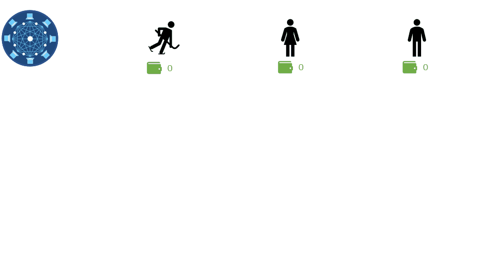
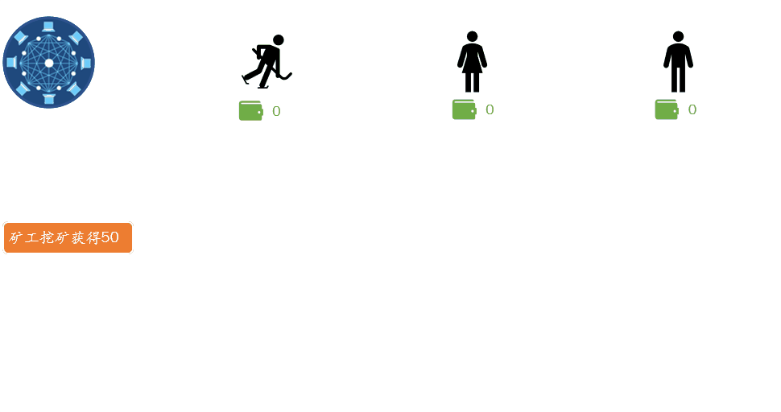
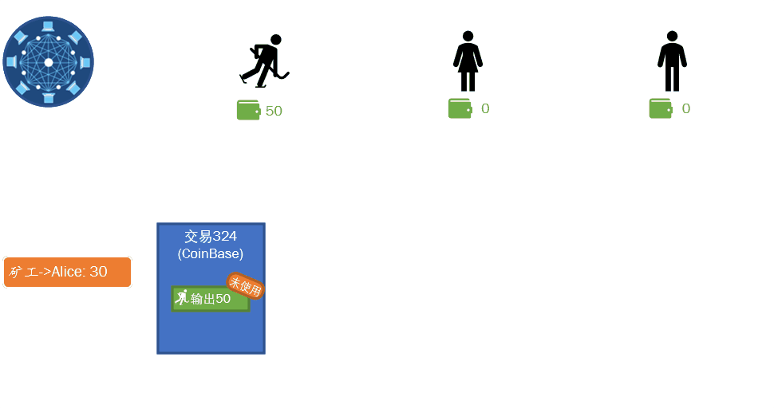
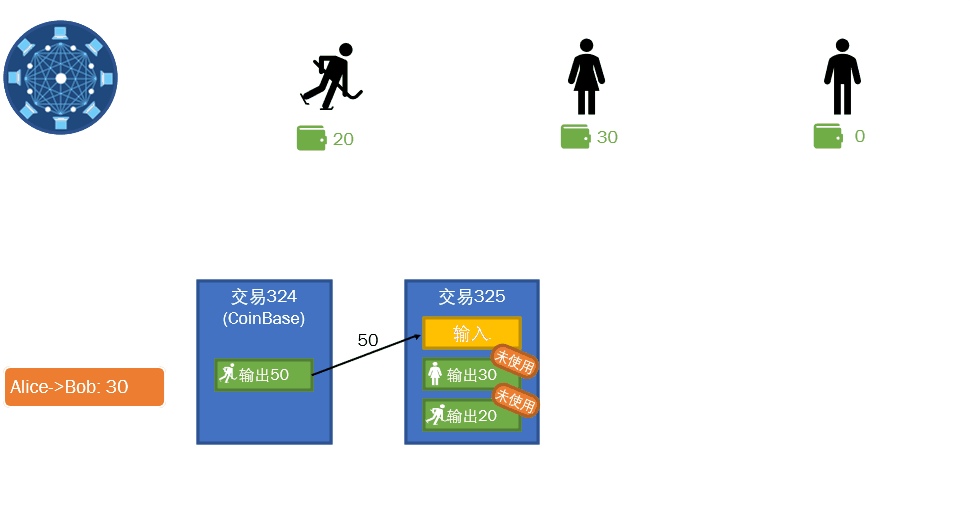
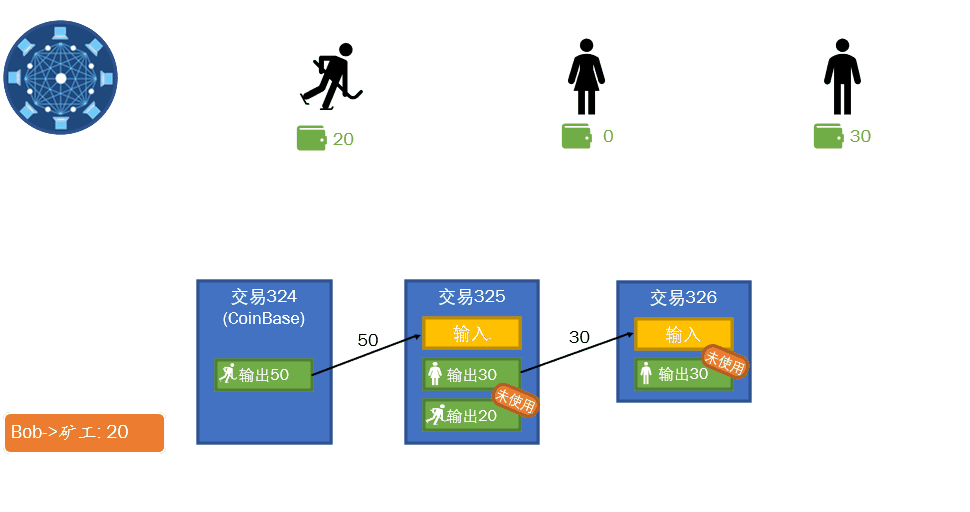
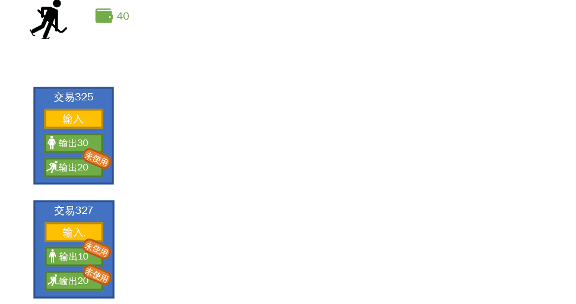

读书提示：本书[发布在此](https://book.uchaindb.com/)，具有更好的阅读体验。

# 复式记账交易结构

比特币使用了复式记账方法，通过这种方法，一是可以了解每一笔资金的来龙去脉，并能完整、系统的反映出整个资金传递过程；二是可以据此验证资金平衡，以检查账户资金记录的正确性。这是一种极其科学的交易记录方式。

## 交易的源头

所有交易的源头都是CoinBase交易，也就是说，任何一笔加密货币中可使用的资金，
均可以通过寻找源头找到最初创造出该笔资金的CoinBase交易，
所以CoinBase交易本身可以认为就是一种创造货币的交易，该创造货币的过程就是区块打包的过程，
由此创造出来的货币也是用来奖励矿工的辛苦计算的。

## 链式交易结构

当Alice想要向Bob付钱时，她需要确认自己的钱包中有足够的金额，
于是她确认了钱包里有Miner之前付给她的钱，于是她才可以把这笔钱付给Bob，
而Miner付给她的这笔钱，也是由区块链网络确认其创建区块的辛苦计算而奖励的金额。
而Bob获得Alice付给的钱后，他便可以将这笔钱进行整体或者分拆使用。
如下表，即为前面这段描述作为链式交易结构的展现。

| 所属区块 | 交易编号 | 发送者 | 接收者 | 金额 |
| ---      | ---      | ---    | ---    | ---  |
| 88       | 324      | 无     | Miner  | 50   |
| 89       | 325      | Miner  | Alice  | 30   |
| 90       | 326      | Alice  | Bob    | 30   |
| 91       | 327      | Bob    | Other  | 10   |

其中，所属区块和交易编号均为随意选择的一个数字，主要用来标记其为连续的多个区块或交易，
而88区块中的324交易为源头的CoinBase交易，即由矿工Miner创造了货币。

复式记账中有“找零”的设计，即若未一次性支付完，需要将多余的部分支付给自己，作为找零。
因此在复式记账的区块链程序中有一个非常重要的概念，即未使用的交易，
而所有试图使用的资金都必须是未使用过的，这个过程类似于实物一般的金币，
当你把金币递给别人后，你就不可能再使用一次这一颗金币了，因为它已经没有在你的手上了。

以下，我们添加上找零和**未使用交易**概念，形成以下这个完全符合复式记账区块链网络的交易表格。

| 所属区块 | 交易编号 | 发送者 | 接收者 | 金额 |
| ---      | ---      | ---    | ---    | ---  |
| 88       | 324      | 无     | Miner  | 50   |
| 89       | 325-1    | Miner  | Alice  | 30   |
|          | 325-2    | Miner  | Miner  | 20   |
| 90       | 326      | Alice  | Bob    | 30   |
| 91       | 327-1    | Bob    | Other  | 10   |
|          | 327-2    | Bob    | Bob    | 20   |

其中，矿工Miner在将手中的50货币中的30货币发送给Alice（交易编号325-1）的同时，
也给自己钱包里面放了20货币（交易编号325-2），
因此原本的50货币被分成了30和20两个可以独立拥有和使用的个体。

最后Bob在将手中的30货币中的10货币发送给他人（交易编号327-1）的同时，
也给自己找零了20货币（交易编号327-2）。

我们继续使用下表，看一下在每一个区块处理完成时的交易及个人余额的状态：

<!-- |            | 交易状态 |       |       |      |       |       |  | 各人余额 |       |     | -->
<!-- | ---        | ---      | ---   | ---   | ---  | ---   | ---   |  | ---      | ---   | --- | -->
<!-- | 已处理区块 | 324      | 325-1 | 325-2 | 326  | 327-1 | 327-2 |  | Miner    | Alice | Bob | -->
<!-- | 88         | 未用     | -     | -     | -    | -     | -     |  | 50       | -     | -   | -->
<!-- | 89         | 已用     | 未用  | 未用  | -    | -     | -     |  | 20       | 30    | -   | -->
<!-- | 90         | 已用     | 已用  | 未用  | 未用 | -     | -     |  | 20       | 0     | 30  | -->
<!-- | 91         | 已用     | 已用  | 未用  | 已用 | 未用  | 未用  |  | 20       | 0     | 20  | -->

<table>
    <thead>
        <tr>
            <th></th>
            <th colspan="6">交易状态</th>
            <th></th>
            <th colspan="3">各人余额</th>
        </tr>
    </thead>
    <tbody>
        <tr>
            <td>已处理区块</td>
            <td>324</td>
            <td>325-1</td>
            <td>325-2</td>
            <td>326</td>
            <td>327-1</td>
            <td>327-2</td>
            <td></td>
            <td>Miner</td>
            <td>Alice</td>
            <td>Bob</td>
        </tr>
        <tr>
            <td>88</td>
            <td>未用</td>
            <td>-</td>
            <td>-</td>
            <td>-</td>
            <td>-</td>
            <td>-</td>
            <td></td>
            <td>50</td>
            <td>-</td>
            <td>-</td>
        </tr>
        <tr>
            <td>89</td>
            <td>已用</td>
            <td>未用</td>
            <td>未用</td>
            <td>-</td>
            <td>-</td>
            <td>-</td>
            <td></td>
            <td>20</td>
            <td>30</td>
            <td>-</td>
        </tr>
        <tr>
            <td>90</td>
            <td>已用</td>
            <td>已用</td>
            <td>未用</td>
            <td>未用</td>
            <td>-</td>
            <td>-</td>
            <td></td>
            <td>20</td>
            <td>0</td>
            <td>30</td>
        </tr>
        <tr>
            <td>91</td>
            <td>已用</td>
            <td>已用</td>
            <td>未用</td>
            <td>已用</td>
            <td>未用</td>
            <td>未用</td>
            <td></td>
            <td>20</td>
            <td>0</td>
            <td>20</td>
        </tr>
    </tbody>
</table>

其中，

- 区块88处理完成时：只有Miner一人获得了创造区块的矿工奖励50，
  该CoinBase交易（编号324）被标记为未使用的交易；
- 区块89处理完成时：Miner将钱分成两笔（编号325-1和325-2）分别给了Alice和自己，
  原CoinBase交易（编号324）被标记为已使用，故未来Miner不能再次使用该笔交易，所以此时他的余额仅为20。
- 区块90处理完成时：Alice将她在编号325-1交易所拥有的钱发送给了Bob，该交易状态变为已用，
  而Bob获得货币的交易（编号326）则为未使用的交易，此时Alice因为用完所有钱，余额为0；
- 区块91处理完成时：类似于区块89的处理过程，Bob将他在编号326交易所拥有的钱发给他人，
  并向自己找零，使得原交易326变为已使用交易，余额也变为新产生的交易327-2所指示的20货币；

以上便是整个交易的处理过程，以下用更加形象的图例展示了整个过程。

（点开以动图的形式详细了解全过程）

<!-- tabs:start -->

#### ** 初始化 **



初始化状态下，矿工、Alice和Bob的钱包都是0；

#### ** 挖矿收益 **



首先由矿工挖出钱币，并以未使用交易的形式存在；

注意步骤中钱包中余额总量与区块链上的未使用输出的总量完全一致；

#### ** 矿工 ➔ Alice **



矿工将自己的钱币，分成20和30两个部分，一个给了Alice，一个给了自己；

注意步骤中钱包中余额总量与区块链上的未使用输出的总量完全一致；

#### ** Alice ➔ Bob **



Alice将自己的所有钱币都给了Bob，自己剩余为0；

注意步骤中钱包中余额总量与区块链上的未使用输出的总量完全一致；

#### ** Bob ➔ 矿工 **



Bob将自己的一部分给了矿工，同样的找零机制，让自己的钱包剩余10；

注意步骤中钱包中余额总量与区块链上的未使用输出的总量完全一致；

<!-- tabs:end -->

**多输入交易**

上面为了简化方便理解，并没有涉及多输入的情况，这里单独来讲解一下多输入的情况，
如下图，当用户拥有多个未使用输出时，需要一次性支付更大数额等场景中，
会让下一笔交易含有多个输入，而对应的未使用输出就是这些输入的总和。



**交易费**

另外还值得注意的是，除了上面提到的这些机制以外，比特币网络中还设计有交易费用，
这个也是非常重要的设计，尤其是当所有有奖励的比特币区块都挖掘完成时，
整个网络的运营就是靠交易费进行维持的。但本章示例的基本程序并未涉及该部分。

## 交易的结构

| 字段         | 描述           | 类型           |
| ---          | ---            | ---            |
| Version      | 版本号         | Byte           |
| MetaData     | 任意字符串     | String         |
| InputTxs     | 输入交易列表   | UInt256[]      |
| OutputOwners | 接收者列表     | TxOutput[]^\*^ |
| Hash         | 本交易的哈希值 | UInt256        |

<!-- code:ClassicBlockChain/Entity/Tx.cs;branch:1_2_basic_blockchain -->

\*注：该类型如以下代码所示，非常简单的仅有接收者和货币数量两个字段。

```cs
public class TxOutput  
{  
    public string Owner { get; set; }  
    public int Value { get; set; }  
}  
```
<!-- code:ClassicBlockChain/Entity/TxOutput.cs;branch:1_2_basic_blockchain -->

该表格中的除了本交易的哈希值以外的所有字段，均会被作为本交易的哈希值计算的基础数据，
故这些字段的任意一点变化均会导致本交易的哈希值的不同，以下对每个字段进行详细解释：

**版本号**。用以标记该交易的数据结构版本，从0开始，每次数据结构发生变化时，将该版本提升1。
该版本发生变化，即认为分叉（分叉的解释可参见1.3.1软分叉、硬分叉）发生。
软件系统可以借助于该字段来对系统进行升级变更。值得注意的是，区块链具有不可修改的特性，
故与传统软件系统升级不同的是，区块链的升级通常需要保留对历史数据的处理代码的情况下，
添加新的数据结构的处理代码。

**任意字符串**。虽然比特币的交易中也确实有类似的用法，比如比特币创世区块中那条著名的话语。
但在本章程序中，该字符串存在的目的，主要还是为了让后续类似的交易拥有不同的交易哈希值。
在比特币的设计中，由于有对交易的签名，而签名的哈希内容中包含了未使用交易的哈希值，
故天然不会出现重复的哈希值。在下一章中，会具体讲解签名的过程，因此进入到下一章后，该字段会被取消。

**输入交易列表**。作为本次交易资金源头输入的未使用交易列表，列表项均为未使用交易的哈希值。
在比特币的设计中，每个列表项应该包含未使用交易的哈希和接收者列表中排序号，在本章的代码中，
此部分被省略，在下一章签名过程后，该部分代码会被补全。

**接收者列表**。作为本次交易的输出，列表项均包含接收者名称和资金数量两个字段，在比特币的设计中，
接收者是以比特币地址存在，本章程序为使学习者更易理解，使用简单的文本代替，
在下一章交易签名学习之后，该地址便会转化成与比特币相仿的地址。

**本交易的哈希值**。将以上所有字段的数据作为哈希运算的基础数据，计算出本交易的哈希值，
但值得特别强调的是，区块链中所有的交易的哈希值都是不一样的，不会有重复的，
相同哈希值的交易会在验证步骤被当作重复交易去除掉。

