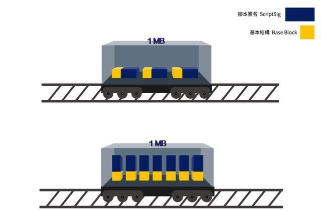

# 区块的验证与创建

到此为止，区块链上最重要的数据结构——区块及交易的数据结构已经讲解清楚了，在本节里将整合前面完成的数据结构，让系统能够持续性的确认交易并创建新的区块。

## 将区块存成链状

为了方便的管理区块的链式结构，我们在此设计了一个BlockChain类，用于管理整个区块链的数据结构。

```cs
public class BlockChain  
{  
    // 当前区块链的计算难度，本章中设定为常数，且为比特币难度概念的翻倍；
    private const byte Difficulty = 2;  
    // 当前区块链支持区块数据结构的版本号；
    private const byte BlockChainVersion = 1;  
    // 一个区块中可以存储的最大交易数量，本章简化为以数量计算，
    // 比特币的实际情况为按照交易的总字节数，最大不超过1M来计算（隔离见证的情况，会略有例外）；
    private readonly int MaxTransactionNumberInBlock = 1000;  
    // 每个区块成功后，矿工可以获得奖励，比特币的实际情况是按照区块数量进行不断减半，直到最后不再有奖励；
    internal readonly int RewardOfBlock = 50;  
    // 存储创世区块；
    public static readonly Block GenesisBlock;  

    // 在初始化区块链的时候，即会立即将创世区块添加至其链上，作为创建时的第一和唯一的一个区块；
    public BlockChain()  
    {  
        this.InitBlocks(GenesisBlock);  
        this.Tail = GenesisBlock;  
    }  
  
    // 存储了所有区块信息，并使用哈希值进行索引；
    public ConcurrentDictionary<UInt256, Block> BlockDictionary { get; }  
    // 存储了从交易的哈希值到区块的索引，方便后续可以快速的找到交易；
    internal ConcurrentDictionary<UInt256, (Block head, int index)> TransactionToBlockDictionary { get; }  
    // 存储了已经被使用过的交易信息，此处其实可以使用HashSet，但为保证线程安全，简单的使用了线程安全的字典类；
    internal ConcurrentDictionary<UInt256, byte> UsedTransactionDictionary { get; }  
    // 区块的高度，本章内容里，这里简单的使用了区块的总量，但值得注意的是，在后续章节，支持共识后，区块总量可能会大于实际的高度，因为可能有共识失败残留下的临时分叉区块；
    public int Height => this.BlockDictionary.Count;  
    // 尾部区块，即最后一个区块，这个也是整个有效区块链的入口，所有搜索都会从这个地方进入；
    public Block Tail { get; set; }  
    // 交易池，存储了所有待入块的交易；
    private ConcurrentQueue<Transaction> TransactionQueue { get; }  

    // 判断在区块链中是否包含指定哈希值的交易；
    internal bool ContainTransaction(UInt256 tranHash)  
    // 添加一笔交易至交易池中；
    internal void AddTransaction(Transaction transaction)  
    // 添加一个区块，添加的区块可以不用填写随机值，该方法会在内部试图寻找使得区块有效的随机值，并在填写后返回该有效的区块；
    internal Block AddBlock(Block block)  
    // 根据一系列的输入交易的哈希值判断是否已经被使用过了；
    internal bool ContainUsedTransactions(UInt256[] inputTransactions)  
    // 批量初始化一个或多个区块，必须是有效的区块；
    internal void InitBlocks(params Block[] blocks)  
    // 通过遍历所有可能的随机数，寻找有效的区块；
    private static Block FindValidBlock(Block originBlock, int difficulty)  
    // 从交易池中取出准备放入区块的交易；
    internal Transaction[] DequeueTransactions()  
    // 根据交易的哈希值获得对应的交易信息；
    internal Transaction GetTransaction(UInt256 hash)  

    // 维护区块链的索引；
    private void MaintainBlockChain(Block newTail)  
    private void MaintainChainDictionary(Block from, Block to)  
}  
```
<!-- code:ClassicBlockChain/Core/BlockChain.cs -->

---

> #### 隔离见证
> 
> 隔离见证是比特币扩容的一种方案，此方案已经于2017年8月在比特币网络上被采用。
> 
> 中本聪在最初比特币源代码中明确规定了每一个区块大小不超过1M。若要对此做出改变，
> 必然形成硬分叉，这是整个比特币界乃至区块链界都非常谨慎的事情。
> 
> 而隔离见证就是把脚本签名(scriptSig)信息从基本结构里拿出来，放在一个新的数据结构当中。
> 做验证工作的节点和矿工也会验证这个新的数据结构里的脚本签名，以确保交易是有效的。
> 
> 当审核统计区块的容量不能超过1M的时候，透过隔离见证，独立出的脚本签名，
> 其大小便不会被计算在内，其实也是利用了早期区块链客户端对区块大小验证上的小疏漏。
> 
> 以下图示以火车车厢运送货物，来清楚的表达隔离见证：
> 
> 图中上半部分是未采用隔离见证的一个区块，以火车的一节车厢作为比喻，
> 而每一笔交易则是以黄色与蓝色的货物做为代表，分别是脚本签名，以及交易的基本结构。
> 
> 
> 
> 原比特币代码仅规定了火车车厢的宽度，并未规定高度，所以藉由把脚本签名从每一笔交易中独立出来，
> 原先只能载三个货物的车厢，便可以容纳七个货物了。
> 
> 也就是说，原先只能容纳三笔交易的一个区块，透过隔离见证，便可以一次传输七笔交易，
> 很好的解决的比特币的扩容问题。
> 
> 另外，隔离见证分成两个部分，以上描述的为第一部分，
> 即通过软分叉与未激活隔离见证的节点实现很好的过渡，第二部分描述了不用分叉而直接扩容的方法，
> 在全网大部分节点均激活了隔离见证后，第二部分的扩容方案即可启用。

---

## 管理区块的创建过程

区块的创建过程是需要算力的，而程序需要一边接受用户的交易请求，一边同时处理打包区块的事务，所以我们使用以下Engine类管理区块的创建过程，使其正常稳定的在独立线程中运行，而不影响主线程处理用户的交易请求。

```cs
public class Engine : IDisposable  
{  
    public readonly BlockChain BlockChain; // 包含区块链的管理类；
    private readonly Thread thWorker; // 独立运行的线程，可以在不影响主进程的情况下进行PoW的计算；
    private bool disposing = false; // 是否进入到结束状态；
    public event EventHandler<Block> OnNewBlockCreated; // 新区块创建成功后事件；
    private readonly string MinerName; // 矿工的名字，用于挖矿成功后，将对应的奖励发送给矿工；
  
    // 初始化类，基本赋值，并启动产生区块的独立线程；
    public Engine(string minerName)  
    {  
        this.MinerName = minerName;  
        this.BlockChain = new BlockChain();  
        this.thWorker = new Thread(this.GenerateBlockThread);  
        this.thWorker.Start();  
    }  
  
    public UInt256 AttachTransaction(Transaction transaction) // 接受用户请求，添加一条交易请求到交易池中；
    private void GenerateBlockThread(object state) // 生成区块的独立线程逻辑；
    private Block GenerateBlock() // 生成区块的主要逻辑；
    private bool ValidateTransaction(Transaction tran) // 验证交易是否有效且可执行的逻辑；

    // 释放区块链的逻辑，将生成区块的独立线程优雅地停下来；
    public void Dispose()  
    {  
        this.disposing = true;  
        this.thWorker.Join();  
    }  
}  
```
<!-- code:ClassicBlockChain/Core/Engine.cs -->

其中该类在本章阶段里，最重要的就是管理区块的生成过程，我们将区块的生成过程放在独立的线程中操作，即以下方法：

```cs
private void GenerateBlockThread(object state)  
{  
    // 本段代码在程序释放之前都会重复执行，以不断产生新的区块，故只有当需要释放程序的控制变量变化时才退出循环；
    while (!this.disposing)  
    {  
        // 独立线程的主程序，为保证线程不会因为意外完全停止工作，我们对通用异常进行一次处理；
        try  
        {  
            // 我们通过一个子程序生成区块，并将其挂载在区块链末尾，最后返回该有效的区块 
            var block = this.GenerateBlock();  
            // 以事件的方式通知外部程序区块的产生，以便外部程序进行相应处理；
            this.OnNewBlockCreated?.Invoke(this, block);  
        }  
        catch (Exception ex)  
        {  
            Console.WriteLine($"Error when generating new block[{ex.Message}]");  
        }  
    }  
}  
```
<!-- code:ClassicBlockChain/Core/Engine.cs -->

## 从交易池中取出交易

打包交易的第一步便是需要从交易池中将指定数量的用户请求取出来，以便后续步骤进行验证后打包至区块中，这里是取出交易的方法：

```cs
internal Transaction[] DequeueTransactions()  
{  
    // 临时建立一个字典，主要目的是对交易池内的交易进行排重；
    var dict = new Dictionary<UInt256, Transaction>();  
    // 不断循环，直到交易池中没有交易或者当前有效交易数量达到我们设定的区块中交易数量，
    // 注意，实际生产中应考虑验证交易的有效性而不仅仅是排重后进行输出，这样才能实际的控制区块中的最终交易数量；
    while (this.TransactionQueue.TryDequeue(out var tran)  
        && dict.Count < this.MaxTransactionNumberInBlock)  
    {  
        // 排重性的添加，若不存在则添加；
        if (!dict.ContainsKey(tran.Hash))  
            dict.Add(tran.Hash, tran);  
        else  
            dict[tran.Hash] = tran;  
    }  
  
    // 返回已经排重的结果；
    return dict.Select(_ => _.Value).ToArray();  
}  
```
<!-- code:ClassicBlockChain/Core/BlockChain.cs -->

## 交易的确认

取出交易过后进行交易的验证，确认交易合法且可加入到区块后，将成为后续打包步骤的输入，此处使用此方法验证交易。

```cs
private bool ValidateTransaction(Transaction tran)  
{  
    // 确认该交易的哈希值没有在现在的区块链上出现，即没有相同的交易，重复交易时不被允许的；
    // 并确认该交易不是已经被使用过的交易，任何交易都只能被使用一次；
    return !this.BlockChain.ContainTransaction(tran.Hash)  
        && !this.BlockChain.ContainUsedTransactions(tran.InputTransactions);  
}  
```
<!-- code:ClassicBlockChain/Core/Engine.cs -->

以下是确认交易存在的方法实现：

```cs
// 该方法简单的对已经维护妥当的区块链中的交易到区块的映射表进行查找即可；
internal bool ContainTransaction(UInt256 tranHash)  
    => this.TransactionToBlockDictionary.ContainsKey(tranHash);  
```
<!-- code:ClassicBlockChain/Core/BlockChain.cs -->


以下是确认输入交易使用过的方法实现：

```cs
internal bool ContainUsedTransactions(UInt256[] inputTransactions)  
{  
    // 将每一个输入交易进行遍历判断；
    foreach (var tran in inputTransactions)  
    {  
        // 在已经使用的交易列表中进行简单的查找，已确认其是否存在；
        if (this.UsedTransactionDictionary.TryGetValue(tran, out var _))  
            return true;  
    }  
  
    // 若没有找到存在，则返回否；
    return false;  
}  
```
<!-- code:ClassicBlockChain/Core/BlockChain.cs -->

## 将交易打包

该方法是由独立的区块打包线程调起的，主要就是从交易池中取出有效的交易，在加上奖励矿工的CoinBase交易后一起打包成功区块的。

```cs
private Block GenerateBlock()  
{  
    // 从区块链的交易池中取出交易，并通过ValidateTransaction方法进行验证，
    // 留下通过验证的交易，其他不能通过验证的交易就丢弃掉；
    var finalTrans = this.BlockChain.DequeueTransactions()  
        .Where(this.ValidateTransaction)  
        .ToList();  
  
    // 创建一笔CoinBase交易，向矿工自己的钱包发送一笔奖励资金，其中由于本章未实现交易签名，
    // 故在MetaData相同的情况，同一矿工的所有CoinBase交易都会有相同的哈希值，
    // 故此处将MetaData填入一个随着时间发生变化的值，便能保证短时间的运行周期内不发生重复；
    var minerTran = new Transaction  
    {  
        OutputOwners = new[] { new TransactionOutput 
            { Owner = this.MinerName, Value = this.BlockChain.RewardOfBlock } },  
        MetaData = DateTime.Now.Ticks.ToString(),  
    };  
    // 将CoinBase交易与普通用户的交易放在一起，准备打包进区块；
    var allTrans = new[] { minerTran }.Concat(finalTrans).ToArray();  
  
    // 从区块链中找到尾部的区块，我们将从该尾部区块开始延生；
    var prevBlock = this.BlockChain.Tail;  

    // 构造一个区块，并让区块链管理模块进行具体区块有效化和创建的操作，最终返回已添加成功的有效区块；
    var block = this.BlockChain.AddBlock(new Block  
    {  
        PreviousBlockHash = prevBlock.Hash, // 前一个区块的哈希值，这也是让区块形成区块链的核心；
        Time = DateTime.Now, // 记录当前的时间；
        Transactions = allTrans, // 包含所有的有效交易；
    });  
    // 将生成成功的有效区块返回出去；
    return block;  
}  
```
<!-- code:ClassicBlockChain/Core/Engine.cs -->

## 区块创建过程

此处将前一步骤中已经打包完成的区块进行最后一道工序的处理，填上正确的版本号和随机数，并最终放入区块链中。

```cs
internal Block AddBlock(Block block)  
{  
    block.Version = BlockChainVersion; // 确保区块的版本号为当前区块链的版本号；
    block = FindValidBlock(block, Difficulty); // 通过计算，找到一个有效的区块；
  
    this.InitBlocks(block); // 将新创建的区块加入到现有的区块链中去；
    // 返回当前找到的有效区块，同时这个区块也是已经顺利添加到区块链末尾的区块；
    return block;  
}  
```
<!-- code:ClassicBlockChain/Core/BlockChain.cs -->

在最后放入区块链前做的最后交易的检查，属于防御性代码。

```cs
private (bool ret, string error) CheckQueueOfTransaction(Transaction transaction)  
{  
    // 若该交易已经存在于区块链上，则返回错误信息；
    if (this.GetTransaction(transaction.Hash) != null)  
    {  
        return (false, "transaction you submit already exist in chain.");  
    }  
  
    // 若该交易已经存在于交易池中，则返回错误信息；
    if (this.TransactionQueue.Any(_ => _.Hash == transaction.Hash))  
    {  
        return (false, "transaction you submit already exist in queue.");  
    }  
  
    // 若无错误，则直接返回正确的处理结果；
    return (true, null);  
}    
```
<!-- code:ClassicBlockChain/Core/BlockChain.cs -->

此方法假设前置步骤已经将准备放入区块链中的区块验证和准备妥当了，此处便进行具体的放入操作并调起区块链维护代码。

```cs
internal void InitBlocks(params Block[] blocks)  
{  
    // 依次将区块放入区块的存储区，以区块的哈希值为索引，以便未来引用，本代码块假定区块已经通过验证，为有效的区块；
    foreach (var block in blocks)  
    {  
        this.BlockDictionary[block.Hash] = block;  
    }  
  
    // 从最后一个区块为起点，维护区块链，此处也假定了区块是顺序的排放的；
    this.MaintainBlockChain(blocks.Last());  
}  
```
<!-- code:ClassicBlockChain/Core/BlockChain.cs -->

## 维护区块链

为了保证区块链能够高效的运行，我们需要一些索引来处理一些访问的请求，因此我们需要对区块链进行维护。

```cs
private void MaintainBlockChain(Block newTail)  
{  
    var prevTail = this.Tail; // 先记录当前的尾部区块；
    this.Tail = newTail; // 将当前的尾部区块赋值为新的尾部区块；

    // 若新的尾部区块与先前不同，则启动维护区块链字典的程序，范围是从创世区块到新的尾部；
    if (this.Tail != prevTail) this.MaintainChainDictionary(GenesisBlock, this.Tail);  
}  
```
<!-- code:ClassicBlockChain/Core/BlockChain.cs -->

以下方法通过遍历从尾部到指定头部之间的区块，以确保新加入的区块中的所有交易都被放入交易的索引字典中，为后续调用做好了准备。

```cs
private void MaintainChainDictionary(Block from, Block to)  
{  
    // 整体程序结构使用游标的方式进行，而且鉴于区块链的数据结构是从尾部指向前一区块，直到最后指到创世区块为止；
    var cursor = to;  
    // 结束的条件是游标到达方法入口指定的起始区块，在本节的场景中，该起始区块其实就是创世区块；
    while (cursor.Hash != from.Hash)  
    {  
        // 我们先从区块字典（数据库）中获得区块的信息；
        var block = this.BlockDictionary[cursor.Hash];  
        // 确定区块的交易字段不为空，正常情况下，除了创世区块之外并无区块会有此种情况，此处主要是防御型代码；
        if (block.Transactions != null)  
        {  
            // 遍历区块中的所有交易；
            for (int i = 0; i < block.Transactions.Length; i++)  
            {  
                // 取出当前准备遍历的交易信息；
                var tran = block.Transactions[i];  
                // 依此信息更新交易到区块的映射关系，使得我们未来可以快速的找到任意一笔交易，
                // 且知道该笔交易所属的区块；
                this.TransactionToBlockDictionary[tran.Hash] = (cursor, i);  
                // 将所有的输入交易都加入到已使用的交易列表中，为下次创建区块时判断交易是否已经被使用过做好准备；
                foreach (var usedTx in tran.InputTransactions ?? new UInt256[] { })  
                {  
                    this.UsedTransactionDictionary[usedTx] = 0;  
                }  
            }  
        }  
  
        // 将游标指向前一区块，继续推进遍历；
        cursor = this.BlockDictionary[cursor.PreviousBlockHash];  
    }  
}  
```
<!-- code:ClassicBlockChain/Core/BlockChain.cs -->

