读书提示：本书[发布在此](https://book.uchaindb.com/)，具有更好的阅读体验。

# 简单交易验证（SPV）

在第一章已经学习过轻量客户端的概念，并知道了并非所有的节点都有能力储存完整的区块链，
因此对于这些被设计成运行在空间和功率受限的设备的轻量客户端，
通过简单交易验证(SPV)的方式可以使它们在不必存储完整区块链的情况下进行工作。

## 为什么需要

在配备SPV的轻量客户端中，不再需要下载所有的区块信息，只需要下载区块头信息，
对于比特币来说，每个区块只有80字节的区块头，因此每年无论有多少交易，
大概都是4.2M字节的区块头信息。因为信息量被控制，于是可以被部署至资源受限的设备中。

区块头中已经包含区块中所有交易组成的哈希树的根信息，若需要验证某笔交易，
只要把该笔交易的查询请求发送给与该轻量客户端相连的全节点即可。

<table>
<tr>
<td rowspan="2">


</td>
<td>

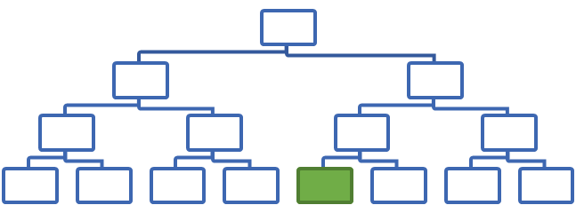
</td>
</tr>
<tr>
<td>

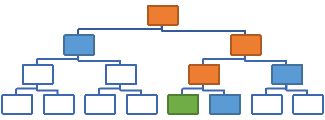
</td>
</tr>
</table>

## 安全性考虑

轻量客户端因为没有完整的区块信息，所以无法保证完全安全，但绝大数情况，
我们并不用担心其安全性，以下重点讲解两种轻量客户端的安全问题。

第一，通过SPV功能，即便是轻量客户端的信息并不充足，
也无法轻易的误以为一笔不存在的交易存在于某个区块中，但是反过来并不成立：
轻量客户端向全节点请求一笔交易的信息，但全节点可以隐瞒信息，
将实际存在的交易告知轻量客户端不存在。换言之，一笔不存在的交易，
轻量客户端绝对有信心可以辨认出来，并不会错把它当作存在的交易，但是一笔实际存在的交易，
轻量客户端却没办法确认其存在，即有可能以为该交易尚不存在。

对于该问题的一种解决方法，就是连接上足够多的全节点，并向每个节点发起同样的请求。
但如果遇到女巫攻击（一个恶意节点可以伪装成很多节点），轻量客户端可能会轻信多个伪装节点的回复信息。

第二，鉴于轻量客户端总是向全节点请求其感兴趣的信息，通常都是其自己所拥有的账户，
这会导致全节点可以轻易的了解用户的全貌（通过类似于同一IP对应哪些账户ID来进行），
进一步导致隐私的泄漏。而且全节点可能会策略性的屏蔽部分用户或账户。
当然轻量客户端也可以选择发送许多假请求来误导全节点，但这也会导致浪费了大量的带宽资源。

对于该问题的解决，比特币设计了Bloom过滤器，可以混淆请求，在有限的资源内，
可以有效的降低全节点识别客户端的风险。该功能将会在高级主题中进行讲解。

该类安全问题主要出自仅实现了SPV功能，无对应防范措施的轻量客户端。

---

> #### 扩展知识
> 
> 为什么叫女巫攻击？
> 
> 根据Flora Rhea Schreiberie在1973年的小说《女巫》（Sybil）改编的同名电影，
> 是一个化名Sybil Dorsett的女人心理治疗的故事。她被诊断为分离性身份认同障碍，兼具16种人格。
> 
> 在对等网络中，节点随时可以加入和退出，为了维持网络稳定，一个节点可能会同时连接上指定数量的多个节点。
> 如果网络中存在一个恶意节点，那么同一个恶意节点可以具有多重身份，
> 就如电影了的女主角都可以分裂出16个身份，实际计算机网络中恶意节点能分出更多节点。
> 于是原本期待连接至多个不同节点的那个节点，
> 便被欺骗地连接到了同一个恶意节点（该恶意节点伪装成多重身份），这就是女巫攻击。
> 
> 如何解决女巫攻击？
> 
> 1. 三方认证，每一个新加入的节点都需要经过指定的信任三方认证后才能加入。
> 2. 投票认证，每一个新加入的节点都需要在网的所有节点投票一致通过后才能加入。
> 3. 工作量证明，即用在比特币网络中使用算力来证明该节点非恶意节点。

---

## 增强节点功能

为了使哈希树支持SPV功能，我们需要在上一节实现的哈希树节点类中添加一些辅助属性和方法，
使得后续抽取和重建部分哈希树的代码更加精简干练。

以下是对哈希树节点类的增强。

```cs
internal class MerkleTreeNode  
{  
    // 对该节点进行标记，该标记会在抽取部分哈希树的时候用于标记找到交易到根间的所有节点；
    public bool IsMarked { get; internal set; }  
    // 当左右子节点同时为空的时候，便说明该节点是叶子节点；
    public bool IsLeaf => this.Left == null && this.Right == null;  
  
    // 枚举当前节点的所有祖先（该节点的父节点及其父节点，并持续递进下去）节点；
    public IEnumerable<MerkleTreeNode> Ancestors()  
    // 枚举当前节点的所有子孙（该节点的子节点及其子节点，并持续递进下去）节点；
    public IEnumerable<MerkleTreeNode> EnumerateDescendants()  
    // 枚举当前节点的所有子孙节点中的叶子节点；
    public IEnumerable<MerkleTreeNode> GetLeafs()  
}  
```
<!-- code:ClassicBlockChain/Entity/MerkleTreeNode.cs -->

以下是枚举当前节点的所有祖先节点的代码实现。

```cs
public IEnumerable<MerkleTreeNode> Ancestors()  
{  
    // 将游标初始化为当前节点的父节点；
    var n = Parent;  
    // 一直循环到父节点为空为止；
    while (n != null)  
    {  
        // 输出游标所在节点；
        yield return n;  
        // 将游标赋值为其父节点；
        n = n.Parent;  
    }  
}  
```
<!-- code:ClassicBlockChain/Entity/MerkleTreeNode.cs -->

以下是枚举当前节点的所有子孙节点的代码实现。

```cs
public IEnumerable<MerkleTreeNode> EnumerateDescendants()  
{  
    // 准备返回用的枚举类型，并将自身放进该枚举，作为最后一个元素，
    // 因为后面均使用Concat语句，将最初放入枚举的内容推迟到最后了；
    IEnumerable<MerkleTreeNode> result = new MerkleTreeNode[] { this };  
    // 若右节点不为空，则将右节点枚举的子孙放入枚举；
    if (Right != null)  
        result = Right.EnumerateDescendants().Concat(result);  
    // 若左节点不为空，则将左节点枚举的子孙放入枚举，这句最后执行，故左节点的子孙会优先被返回；
    if (Left != null)  
        result = Left.EnumerateDescendants().Concat(result);  
    // 返回这个枚举结果；
    return result;  
}  
```
<!-- code:ClassicBlockChain/Entity/MerkleTreeNode.cs -->

以下是枚举当前节点所有子孙节点中的叶子节点。

```cs
public IEnumerable<MerkleTreeNode> GetLeafs()  
{  
    // 通过枚举所有子孙节点的方法获取所有子孙节点，然后用筛选语句将其中的叶子节点筛选出来；
    return EnumerateDescendants().Where(l => l.IsLeaf);  
}  
```
<!-- code:ClassicBlockChain/Entity/MerkleTreeNode.cs -->

## 部分哈希树

轻量客户端验证交易的过程如下图。

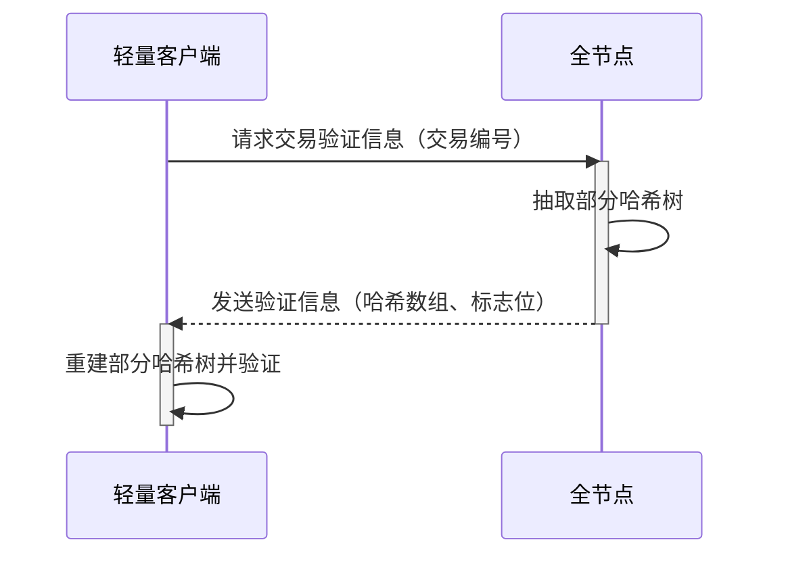

在轻量客户端向全节点请求交易验证信息后，全节点会根据轻量客户端提供的交易编号，
将与该交易有关的区块中的交易哈希树抽取部分哈希树（Partial Merkle Tree），
借此按照一定算法生成便于客户端重建部分哈希树，并且网络传输友好的信息——哈希数组和标志位，
在轻量客户端得到相应的信息后，便进行重建部分哈希树，并根据重建结果验证交易信息。

如下图所示的非空心节点组成的树便是部分哈希树，其中绿色方块表示轻量客户端正在请求的交易节点，
蓝色的方块是需要从全节点传回以便在轻量客户端重建部分哈希树所需要的节点，
而橙色方块是可由轻量客户端自行计算出来的节点，而且为了验证交易的正确性必须进行计算的节点。

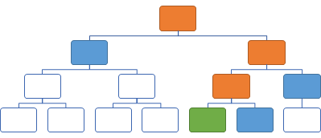

后续内容在描述算法时，对哈希树上的节点进行了简单分类，如下图，在树形结构最下方一排的节点，
即直接从交易信息算出哈希值的节点被成为交易节点，除此之外的所有节点均被称之为非交易节点，
因为这些节点的哈希值均是通过计算得出的。

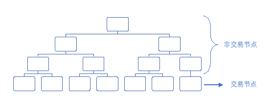

虽然从系统运行的顺序看，应该显示抽取部分哈希树，再是重建部分哈希树，
但后续章节先讲重建部分哈希树，使得读者可以先感受一下从哈希列表和标志位重建部分哈希树的全过程，
为抽取部分哈希树的代码理解打下基础。

## 重建部分哈希树

要重建部分哈希树，需要至少三个参数：

- 交易数量，用以重建完整哈希树的形状，并明确其高度；
- 哈希列表和标志位，用以正确的重建部分哈希树；

要验证该部分哈希树，需要两个信息：

- 只有区块头信息的区块链，以确保区块呈链状结构，无篡改的可能性；
- 重建完成的部分哈希树，该哈希树根的哈希值应与区块头中的默克尔根一致；

在重建部分哈希树时，会根据收到的标志位进行逐步运算，运算规则如下表所示：

<table>
  <tr>
    <th>标志位</th>
    <th>交易节点</th>
    <th>非交易节点</th>
  </tr>
  <tr>
    <td>0</td>
    <td>使用哈希列表中下一个哈希值作为该节点的哈希值，该节点并非请求的交易。</td>
    <td>使用哈希列表中下一个哈希值作为该节点的哈希值，不再处理子节点。</td>
  </tr>
  <tr>
    <td>1</td>
    <td>使用哈希列表中下一个哈希值作为该节点的哈希值，并且该节点就是请求中交易。</td>
    <td>
      该节点的哈希值需要计算； <br/>                                      
      先处理其左子节点以获取其哈希值；<br/>                               
      再处理其右子节点以获取其哈希值；<br/>                               
      最后将左右子节点的哈希值汇总生成该节点的哈希值；<br/>               
    </td>
  </tr>

</table>

考虑到该部分难度较大，这里选取了一个实例进行演示运算过程。该过程一步一步的演示了从空白的哈希树重建出部分哈希树，最终证明该哈希存在于该哈希树。

| 图例                                                     |
| ---                                                      |
| 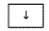等待子节点的计算     |
| 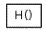已计算出哈希值       |
| 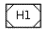从列表中选取了哈希值 |
| 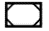目标的交易           |

<div id="table1">
<table>
<thead>
<tr class="header">
<th>哈希树</th>
<th>参数</th>
<th>步骤详情</th>
</tr>
</thead>
<tbody>
<tr v-for="step in steps">
<td></td>
<td>
哈希列表：<br/>
<span style="white-space: nowrap">{{step.hashList}}</span><br/>
标志位：<br/>
{{step.tagList}}</td>
<td v-html="marked((step.extraExplain ? step.extraExplain + '\n' : '') + explains[step.explain])"></td>
</tr>
</tbody>
</table>
</div>

为了支持重建部分哈希树，在哈希树类中添加以下方法。

```cs
public class MerkleTree  
{  
    // 获取该部分哈希树的根节点哈希值，通常可将该值与存于区块头中的默克尔树根值进行对比以确认信息未被更改，
    // 传入参数即为交易数量、哈希列表和标志位；
    public static UInt256 GetPartialTreeRootHash(int txNumber, UInt256[] hashes, BitArray flags)  
    // 私有方法，被前项方法调用，用于实际构建部分哈希树，传入树高度（由交易的数量决定）、
    // 哈希列表和标志位，获得创建成功的部分哈希树树根节点的引用；
    private static MerkleTreeNode BuildPartialTree(Queue<UInt256> hashes, int height, Queue<bool> flags)  
}  
```
<!-- code:ClassicBlockChain/Entity/MerkleTree.cs -->

```cs
private static MerkleTreeNode BuildPartialTree(
    Queue<UInt256> hashes, int height, Queue<bool> flags)  
{  
    // 本方法属于递归方法，每一次递归分别处理其左右子树时，均会将高度降低1，
    // 当高度为0时，说明已经出了该哈希树的界限，故返回空，表示无子节点了；
    if (height == 0) return null;  

    var flag = flags.Dequeue(); // 从标志位中取出一个标志；
    if (flag)  
    {  
        // 高度为1，即说明该节点为交易节点。
        if (height == 1)  
        {  
            // 按照交易节点-1处理：使用哈希列表中下一个哈希值作为该节点的哈希值，
            // 并且该节点就是请求中交易，代码中将其标记出来；
            var leaf = new MerkleTreeNode(hashes.Dequeue()) { IsMarked = true };  
            return leaf;  
        }  
        else // 按照非交易节点-1处理；
        {  
            // 先处理其左子节点以获取其哈希值；
            var left = BuildPartialTree(hashes, height - 1, flags);  
            // 再处理其右子节点以获取其哈希值；
            var right = BuildPartialTree(hashes, height - 1, flags);  
            // 最后将左右子节点的哈希值汇总生成该节点的哈希值；
            var parent = new MerkleTreeNode(left, right);  
            return parent;  
        }  
    }  
    else  
    {  
        // 按照交易节点-0处理：使用哈希列表中下一个哈希值作为该节点的哈希值，该节点并非请求的交易；
        if (height == 1)  
        {  

            var leaf = new MerkleTreeNode(hashes.Dequeue());  
            return leaf;  
        }  
        // 按照非交易节点-0处理：使用哈希列表中下一个哈希值作为该节点的哈希值，不再处理子节点；
        else  
        {  
            var leaf = new MerkleTreeNode(hashes.Dequeue());  
            return leaf;  
        }  
    }  
}  
```
<!-- code:ClassicBlockChain/Entity/MerkleTree.cs -->

以下方法通过调用前一个方法，返回该部分哈希树的根节点哈希值。

```cs
public static UInt256 GetPartialTreeRootHash(int txNumber, UInt256[] hashes, BitArray flags)  
{  
    // 计算出该哈希树的高度；
    var height = (int)Math.Ceiling(Math.Log(txNumber, 2)) + 1;  
    // 调用创建部分哈希树的递归方法进行创建，并获得树根节点的引用；
    var tree = BuildPartialTree(new Queue<UInt256>(hashes), height, new Queue<bool>(flags.OfType<bool>()));  
    // 返回树根的哈希值，可将该值与存于区块头中的默克尔树根值进行对比以确认信息的正确性；
    return tree.Hash;  
}  
```
<!-- code:ClassicBlockChain/Entity/MerkleTree.cs -->

其中，通过公式$height = \left\lceil \ \operatorname{}\text{txNumber\ } \right\rceil + 1$计算出该哈希树的高度；

## 抽取部分哈希树

因为和重建部分哈希树相比，抽取部分哈希树显得更加抽象，所以才特意安排为先让读者理解了重建的过程后，
再来学习抽取的过程。

抽取部分哈希树的过程就是从一颗完整的哈希树，根据所请求的节点，
将含有该节点的及其验证节点的子树按照哈希列表和标志位的存储形式抽取出来。

在抽取部分哈希树时，会根据匹配规则对输出的哈希列表和标志位进行增加，规则如下表所示：

<table>
  <tr>
    <th>标记位</th>
    <th>交易节点</th>
    <th>非交易节点</th>
  </tr>
  <tr>
    <td>无标记</td>
    <td>
      向标志位添加0；       <br/>                                      
      将本节点添至哈希列表；<br/>                               
    </td>
    <td>
      向标志位添加0；       <br/>                                      
      将本节点添至哈希列表；<br/>                               
      不再处理子节点；      <br/>                               
    </td>
  </tr>
  <tr>
    <td>有标记</td>
    <td>
      向标志位添加1；       <br/>                                      
      将本节点添至哈希列表；<br/>                               
    </td>
    <td>
      向标志位添加1；           <br/>                                      
      分别处理左右节点；        <br/>                               
      不要将本节点添至哈希列表；<br/>                               
    </td>
  </tr>
</table>

其中，在启动时的第一步会对哈希树进行标记，将目标节点及其祖先标记出来，
也因此将哈希树中的节点分成了有标记和无标记两种。

以下同样选取了和前一节同样的实例进行演示运算过程。
该过程一步一步的演示了从完整哈希树抽取出部分哈希树，并以哈希列表和标志位的方式存储。

| 图例                                                  |
| ---                                                   |
| 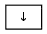等待子节点的计算   |
| 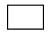不需要的节点       |
| 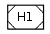放入哈希列表的节点 |
| 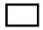标记的节点         |

<div id="table2">
<table>
<thead>
<tr class="header">
<th>哈希树</th>
<th>参数</th>
<th>步骤详情</th>
</tr>
</thead>
<tbody>
<tr v-for="step in steps">
<td></td>
<td>
哈希列表：<br/>
<span style="white-space: nowrap">{{step.hashList}}</span><br/>
标志位：<br/>
{{step.tagList}}</td>
<td v-html="marked(explains[step.explain])"></td>
</tr>
</tbody>
</table>
</div>

```cs
public class MerkleTree  
{  
    public (UInt256[] hashes, BitArray flags) Trim(Predicate<UInt256> filter)  
    private static void Trim(MerkleTreeNode root, List<UInt256> hashes, List<bool> flags, Predicate<UInt256> filter)  
    private static void MarkToTop(MerkleTreeNode leaf, bool value)  
    private static void TrimCore(MerkleTreeNode node, List<UInt256> hashes, List<bool> flags)  
}  
```
<!-- code:ClassicBlockChain/Entity/MerkleTree.cs -->

```cs
private static void MarkToTop(MerkleTreeNode leaf, bool value)  
{  
    leaf.IsMarked = value;  
    foreach (var ancestor in leaf.Ancestors())  
    {  
        ancestor.IsMarked = value;  
    }  
}  
```
<!-- code:ClassicBlockChain/Entity/MerkleTree.cs -->

```cs
private static void TrimCore(MerkleTreeNode node, List<UInt256> hashes, List<bool> flags)  
{  
    if (node == null)  
        return;  
    flags.Add(node.IsMarked);  
    if (node.IsLeaf || !node.IsMarked)  
        hashes.Add(node.Hash);  
  
    if (node.IsMarked)  
    {  
        TrimCore(node.Left, hashes, flags);  
        TrimCore(node.Right, hashes, flags);  
    }
}  
```
<!-- code:ClassicBlockChain/Entity/MerkleTree.cs -->

```cs
private static void Trim(MerkleTreeNode root, List<UInt256> hashes, List<bool> flags, Predicate<UInt256> filter)  
{  
    foreach (var leaf in root.GetLeafs().Where(_ => filter(_.Hash)))  
    {  
        MarkToTop(leaf, true);  
    }  
  
    TrimCore(root, hashes, flags);  
}  
```
<!-- code:ClassicBlockChain/Entity/MerkleTree.cs -->

```cs
public (UInt256[] hashes, BitArray flags) Trim(Predicate<UInt256> filter)  
{  
    var flags = new List<bool>();  
    var hashes = new List<UInt256>();  
    Trim(root, hashes, flags, filter);  
  
    return (hashes.ToArray(), new BitArray(flags.ToArray()));  
}  
```
<!-- code:ClassicBlockChain/Entity/MerkleTree.cs -->

<script>
  new Vue({
    el: '#table1',
    data: { 
      steps: [
        { image: 'restruct01.png', hashList: 'H1 H2 H3 H4', tagList: '1 0 1 1 1 0 0', explain: 'init' }, 
        { image: 'restruct02.png', hashList: 'H1 H2 H3 H4', tagList: '1 0 1 1 1 0 0', explain: 'nontx_tagged', extraExplain: '从根节点开始\n' },
        { image: 'restruct03.png', hashList: 'H1 H2 H3 H4', tagList: '0 1 1 1 0 0', explain: 'nontx_notag' },
        { image: 'restruct04.png', hashList: 'H2 H3 H4', tagList: '1 1 0 0', explain: 'nontx_tagged', extraExplain: '回到根节点<br/>继续处理右子节点\n' },
        { image: 'restruct05.png', hashList: 'H2 H3 H4', tagList: '1 0 0', explain: 'nontx_tagged' },
        { image: 'restruct06.png', hashList: 'H2 H3 H4', tagList: '0 0', explain: 'tx_tagged' },
        { image: 'restruct07.png', hashList: 'H3 H4', tagList: '0 0', explain: 'tx_notag' },
        { image: 'restruct08.png', hashList: 'H4', tagList: '<空>', explain: 'compute' },
        { image: 'restruct09.png', hashList: 'H4', tagList: '<空>', explain: 'nontx_notag' },
        { image: 'restruct10.png', hashList: 'H4', tagList: '<空>', explain: 'compute' },
        { image: 'restruct11.png', hashList: 'H4', tagList: '<空>', explain: 'compute' },
      ],
      explains: {
        init: '根据交易数量初始化树形结构',
        root: '在哈希树中标记目标节点及其祖先',
        nontx_tagged: `执行**非交易节点-1**：
- 先处理左子节点`,
        nontx_notag: `执行**非交易节点-0**：
- 提取哈希值；`,
        tx_tagged: `执行**交易节点-1**：
- 提取哈希值；
- 标记为请求的交易；`,
        tx_notag: `执行**交易节点-0**：
- 提取哈希值；`,
        compute: '根据左右子节点计算该节点哈希值'
      }
    }
  });
  new Vue({
    el: '#table2',
    data: { 
      steps: [
        { image: 'extract01.png', hashList: '<空>', tagList: '<空>', explain: 'init' },
        { image: 'extract02.png', hashList: '<空>', tagList: '<空>', explain: 'mark' },
        { image: 'extract03.png', hashList: '<空>', tagList: '1', explain: 'nontx_tagged' },
        { image: 'extract04.png', hashList: 'H12', tagList: '1 0', explain: 'nontx_notag' },
        { image: 'extract05.png', hashList: 'H12', tagList: '1 0 1', explain: 'nontx_tagged' },
        { image: 'extract06.png', hashList: 'H12', tagList: '1 0 1 1', explain: 'nontx_tagged' },
        { image: 'extract07.png', hashList: 'H12 H5', tagList: '1 0 1 1 1', explain: 'tx_tagged' },
        { image: 'extract08.png', hashList: 'H12 H5 H6', tagList: '1 0 1 1 1 0', explain: 'tx_notag' },
        { image: 'extract09.png', hashList: 'H12 H5 H6', tagList: '1 0 1 1 1 0', explain: 'back' },
        { image: 'extract10.png', hashList: 'H12 H5 H6 H11', tagList: '1 0 1 1 1 0 0', explain: 'nontx_notag' },
        { image: 'extract11.png', hashList: 'H12 H5 H6 H11', tagList: '1 0 1 1 1 0 0', explain: 'back' },
        { image: 'extract12.png', hashList: 'H12 H5 H6 H11', tagList: '1 0 1 1 1 0 0', explain: 'back' },
      ],
      explains: {
        init: '初始化完整哈希树',
        mark: '在哈希树中标记目标节点及其祖先',
        nontx_tagged: `执行**非交易节点-有标记**：
- 向标志位添加1；
- 分别处理左右节点；
- 不要将本节点添至哈希列表；`,
        nontx_notag: `执行**非交易节点-无标记**：
- 向标志位添加0；
- 将本节点添至哈希列表；`,
        tx_tagged: `执行**交易节点-有标记**：
- 向标志位添加1；
- 将本节点添至哈希列表；`,
        tx_notag: `执行**交易节点-无标记**：
- 向标志位添加0；
- 将本节点添至哈希列表；`,
        back: '处理完左右节点，回退，但并不将该节点添至哈希列表；'
      }
    }
  });
</script>

