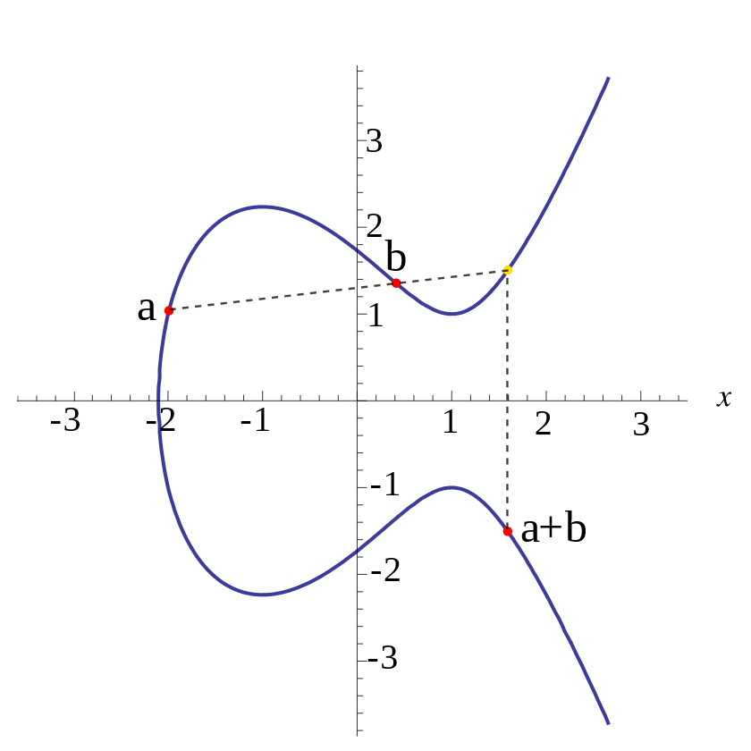
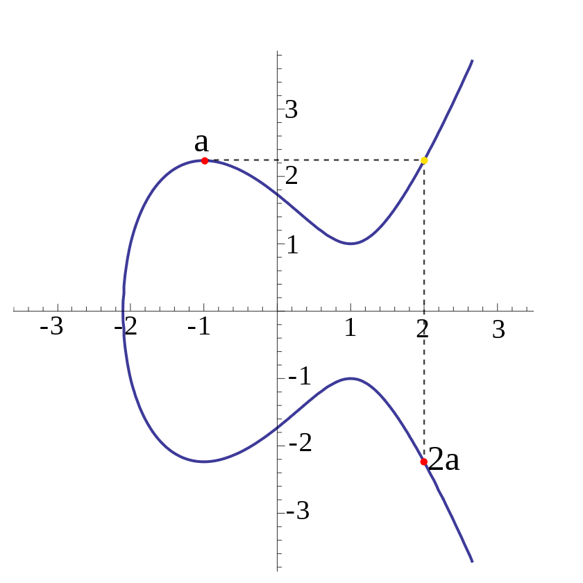
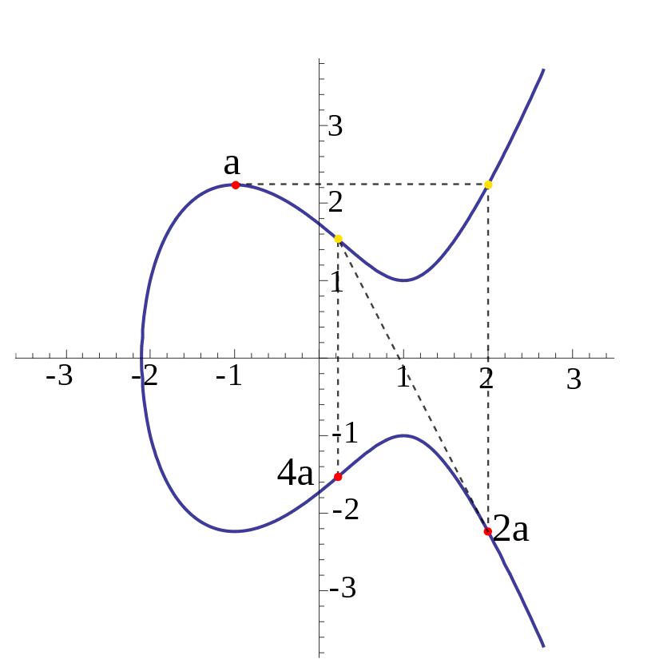
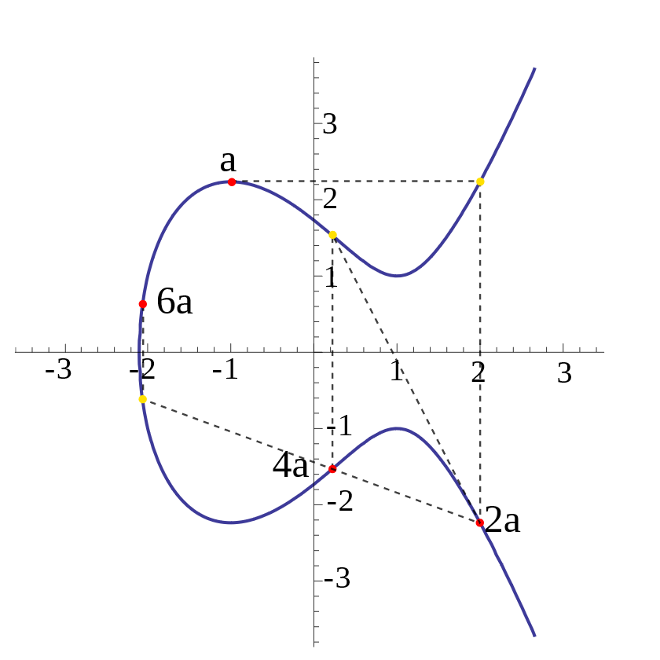
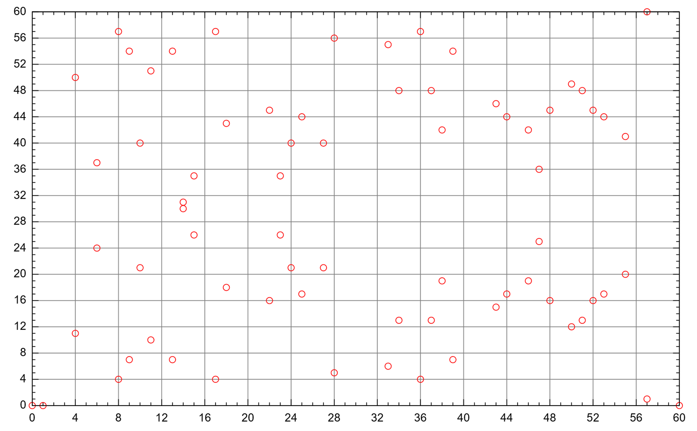
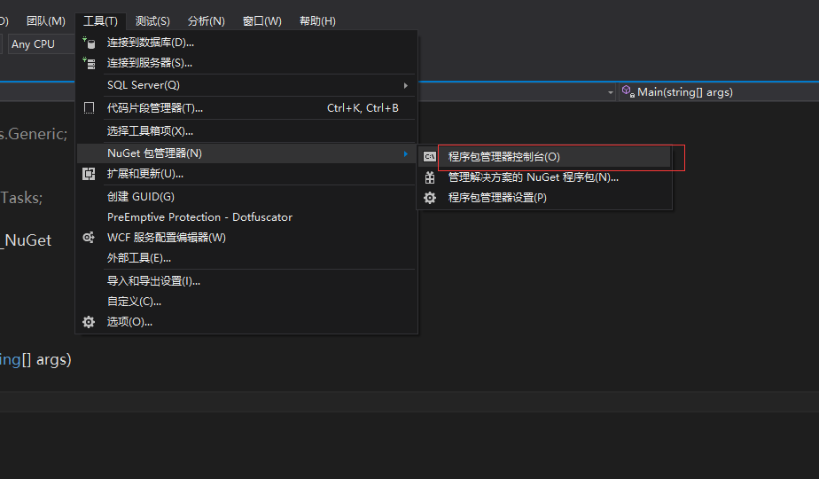
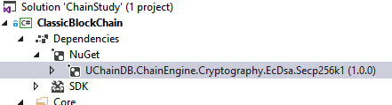

读书提示：本书[发布在此](https://book.uchaindb.com/)，具有更好的阅读体验。

# 数字签名

在第一章，我们已经初步了解了如何使用密码学中的非对称加密算法来做数字签名，
在本章中会重点讲解被用在比特币中的椭圆曲线密码学。

## 椭圆曲线密码学

椭圆曲线可以在平面域中用 $y^{2} = x^{3} + ax + b$ 描述，
例如当$a=-3$, $b=3$时，即$y^{2} = x^{3} - 3x + 3$的曲线如下图a所示。

定义一种在此曲线上的加法，即选择任意非对称的两个点，连接这两个点，并使得延长线与该曲线相交，
该交点在x轴的对称点即为该加法的结果，如下图b所示，我们选取了$a$和$b$两个点，
连接并取其延长线与曲线的交点的对称点为其结果$a+b$。

|  |  |
| :-:                        | :-:                        |
| a                          | b                          |

若使$b=a$，计算$a+b$即为计算$2a$，而连接两个点的连接线因为两个点是在同一位置而成为该点的切线，
如下图c所示，通过$a$点的切线与曲线相交，并取该交点的对称点为$2a$。重复该过程，
可以得到如下图d中的$4a$。若需要计算的结果并非2的幂次，可以通过加法的方法进行计算，
如下图e，我们要计算$6a$则只需要计算$4a+2a$，$4a$和$2a$已经在下图c和下图d中计算出来，
使用曲线上加法的基本定义，连接$4a$和$2a$两个点，延长并与曲线相交，取该交点的对称点为$6a$。

|  |  |  |
| :-:                        | :-:                        | :-:                        |
| c                          | d                          | e                          |

因此，当需要计算na时，应将n分解成多个2的不同幂次的和的形式，例如当n=12345时，
可以分解成：$n = 2^{13} + 2^{12} + 2^{5} + 2^{4} + 2^{3} + 2^{0}$，
因此计算该数字总共需要的加法计算次数=最大幂次+分解加法次数$=13+5=18$。
由此可以看出，即便当数字非常大的时候，计算的次数也不会发生非常大的变化。

在椭圆曲线密码学中，作为公共基础的信息有以下几项：

- 曲线参数$a$和$b$，即椭圆曲线$y^{2} = x^{3} + ax + b$的参数；
- 基础点$G$，即我们选取的曲线上的初始点，如上图c中的$a$点；
- 有限域$Fp$，即结果可以处于的有限数范围\*；
- 基于基础点$G$的阶数$n$，即处于该有限域上可能的点的个数\*\*；
- 阶数$n$的`协因子`\*\*；

注\*：对于有限域的理解，大可不必恐慌，其概念其实非常简单，
即根据计算机的特点设计出来可由计算机表示的有限的数字范围，与实数域不同的是，
在有限域中并不可以表示任意数字，而且有最大值，
所有超过这个最大值的数字都会经过一定的方法回到这个有限域中。
而椭圆曲线在有限域的样子大概如下图：（虽是离散点，但其对称性依旧保留下来了）



注\*\*：通常通过一定量的计算后，某一个数值$n$会使得$nG=0$，即该点的切线不与曲线上其他任一点相交，
而比特币所使用的secp256k1中的$n$是素数，即不可被因式分解，故其协因子为1。

## 数字签名

在此继续使用第一章使用过的示例，仍旧是Alice要发送消息给Bob，需要对她发送的消息进行签名，以防止Eve篡改伪造。

| 步骤                     | 只有Alice知道的信息                 | 所有人都知道的信息                               |
| ---                      | :-:                                 | :-:                                              |
| 定义曲线参数             |                                     | 曲线参数(Fp,a,b,G,n,h)                           |
| 选取一个正实数，即私钥   | $$d \in \lbrack 1,\ n - 1\rbrack$$  |                                                  |
| 计算dG的乘积，即公钥     | $$\left( Q_{x},Q_{y} \right) = dG$$ | $$\left( Q_{x},Q_{y} \right)$$                   |
| 准备发送的消息           |                                     | m                                                |
| 对消息做哈希计算         |                                     | e=HASH(m)                                        |
| 选择一个安全的随机数     | $$k \in \lbrack 1,\ n - 1\rbrack$$  |                                                  |
| 使用该随机数计算曲线点   | $$\left( x_{1},y_{1} \right) = kG$$ |                                                  |
| 对发送的消息签名，并公开 | $r = x_{1}\bmod n$ <br/> $s = k^{- 1}\left( z + rd \right)\text{mod\ n}$ | (r, s)      |
| 根据已知信息进行验算     | | ${w = s}^{- 1}\text{mod\ n}$ <br/>$u_{1} = zw\ mod\ n,\ u_{2} = rw\ mod\ n$ <br/>$\left( x_{1},y_{1} \right) = u_{1}G + u_{2}Q$ <br/> |
| 确认签名                 |                                     | $$r \equiv x_{1}\text{\ mod\ n}$$                |

鉴于椭圆曲线算法本身已经不是直接按计算器就能算出来的算法了，
故部分读者可能无法从上述过程中看到为何Eve很难伪造签名，这里举个通俗的例子来说明，
如下图，我们知道曲线的基本参数，然后Eve只能知道Alice公布的她的公钥Q点，
这个是无法逆转知道$dG=Q$，对于Eve来说，想要知道私钥d的唯一可能就是从1开始枚举所有可能的数字，
使得$dG=Q$，这时候Alice的私钥d便被破解了，但若d的数字非常大，
以现在的计算机能力可能会是耗费非常久的时间都无法计算出来；而对于验证签名，却非常简单，
只要将Alice提供的数字带入到曲线中去做非常有限次的计算便可以验证其正确性。


注意一：本段解释尽量使用通俗的文字让无充分学术背景的读者也可以轻松的理解，
故部分概念做了简化处理，若需要做学术研究，请另行参考密码学读物。

注意二：比特币所使用的secp256k1曲线，并未采用其他曲线常采用的二进制有限域$GF(2^{n})$。

---

> #### 扩展知识
> 
> 2010年12月，一群自称failOverflow的黑客，通过PS3上的程序漏洞获得了使用椭圆曲线算法签名的私钥，
> 至此也就宣告PS3被彻底成功破解。
> 
> 而这个程序漏洞就是由于在使用椭圆曲线算法进行签名时，使用了不安全的随机数——一个固定值，
> 使得签名中r始终相同，黑客由此反推出了私钥Q。

---

## 引用第三方组件

本章中已经详细的讲解了椭圆曲线密码学，但是我们并不准备在代码上去实现和讲解一次，
学习密码学的细节是为了让开发者在编写代码时能更加谨慎，避免由于代码错误带来的灾难。

非对称密码学，在签名和加密领域都是非常重要的，而以密码学为基础的区块链，
其重要程度决不可小觑，在该领域发生的许多安全事件均是由于代码编写错误导致的，
通过详细理解其数学基础，并良好的编写对应代码才可以避免灾难一般的后果。

本节中会引用第三方组件，一方面是可以免去密码学冗长的实现细节，
另一方面该组件也融合了网上两种不同的开源实现，以到达功能和效率的平衡。

首先我们通过程序包管理器控制台（在VS中参照下图），安装该组件。



可在程序包管理器控制台键入以下命令：

```
PM> Install-Package UChainDB.ChainEngine.Cryptography.EcDsa.Secp256k1
```

命令完成后，再查看工程时，可在依赖项下面看到该第三方组件的存在：



---

> #### 扩展知识
> 
> **什么是NuGet？**
> 
> NuGet（读作New Get）是用于微软.NET开发平台的软件包管理器，是一个Visual Studio的扩展。在使用Visual Studio开发基于.NET Framework的应用时，NuGet能够令你在项目中添加、移除和更新引用的工作变得更加快捷方便。
> 
> 通过NuGet你可以很容易的访问到其他开发者发布的软件包，你也可以创建、分享或者发布自己的包到NuGet。微软的EntityFramework、ASP.NET MVC等或者一些常用到的第三方软件包：Json.NET、NUnit等都托管到NuGet上。
> 
> **为什么要用NuGet？**
> 
> 上面说道NuGet实际上就是一个软件包的托管平台。一个大的项目不可能所有的功能都要自己去实现，有句话说的好：“不要轻易造轮子”，最简单直接的办法就是使用别人造好的“轮子”。通常引用一个类库到我们的项目中要先下载或找到类库，然后复制到项目目录，最后添加引用。
> 
> 如果我们引用的类库有更新的版本并且我们想使用的话又要重新添加引用，一两个倒还好，如果引用数量较多的话重复添加引用是比较麻烦和枯燥的，并且要卸载引用的时候还是要经过几个步骤。
> 
> 这也就是为什么推荐使用NuGet的原因，NuGet能够让我们轻松的实现对软件包的引用、更新和卸载。

---

## 密码学实体强类型

使用C++、Java、C\#等类的高级语言的一大特点就是强类型，使得很多错误可以在编译时就发现，
本章中私钥、公钥、签名等信息均是以字节数组的形式存储在计算机内存中的，
但若直接使用字节数组作为各种方法的输入输出参数，难免会出现传入了错误的参数，
或者将传出的参数误用的情况，如以下代码中，两行代码是同一功能的接口定义：

```cs
byte[] Sign(IEnumerable<byte[]> data, byte[] privateKey);    
Signature Sign(IEnumerable<byte[]> data, PrivateKey privateKey);    
```

第二行中因为使用Signature和PrivateKey实体类型，使得传入参数时可以做类型检查，避免出错，
而第一行中的接口，我们甚至无法在不查阅文档的情况下知道其返回的究竟是什么。

综上所述，我们需要定义密码学实体的强类型。

首先我们定义字节数组长度的定义类。

```cs
public abstract class ByteArrayDef  
{  
    // 我们使用抽象类中的抽象属性，使得实现该抽象类的具体类可以给出具体值，
    // 而该值的含义即是字节数组的固定长度，以方便我们做运行时检查。
    public abstract int Length { get; }  
}  
```
<!-- code:ClassicBlockChain/Entity/ByteArray.cs -->


以下的字节数组类`ByteArray<T>`，使用了刚才定义的字节数组定义类作为泛型的输入，
以便在基类中对该类型的字节长度进行运行时检查。（非关键代码被隐藏，请查阅配套代码查看完整示例）

```cs
public abstract class ByteArray<T> where T : ByteArrayDef, new()  
{  
    protected readonly byte[] bytes; // 内部实际存储的字节数组；
    protected readonly T Def = new T(); // 字节数组定义类，并在类型初始化时进行实例化；
  
    // 字节数组类的构造函数，输入真正的字节数组，在内部对其封装；
    public ByteArray(byte[] byteArray)  
    {  
        // 根据字节数组定义类中指定的字节数组长度，对输入的参数进行运行时检查
        if (byteArray.Length != this.Def.Length)  
        {  
            // 若长度不为预定值时，抛出异常；
            throw new ArgumentException(
                $"Length should be {this.Def.Length}", nameof(byteArray));  
        }  
  
        this.bytes = byteArray; // 将符合标准的字节数组赋值在内部存储中；
    }  
  
    // 鉴于本类究其本质就是字节数组，故此处申明可隐式转换成系统中的字节数组，以方便操作；
    public static implicit operator byte[] (ByteArray<T> obj)  
    // 将该字节数组以Base58的形式输出，关于Base58的内容请参阅后续章节；
    public string ToBase58()  
    // 重载相等、不等操作符，方便比较两个字节数组的内容是否一致，即可比较签名、私钥、公钥等是否是相同的；
    public static bool operator ==(ByteArray<T> left, ByteArray<T> right)  
    public static bool operator !=(ByteArray<T> left, ByteArray<T> right)  
    public override bool Equals(object obj)  
    public override int GetHashCode()  
}  
```
<!-- code:ClassicBlockChain/Entity/ByteArray.cs -->

以上我们定义基本的字节数组抽象类的主要目的，还是为我们后续定义真正被使用的签名、私钥、公钥等类时，
可以减少重复的代码。

以下是签名类的定义类。

```cs
public class SignatureDef : ByteArrayDef  
{  
    // 定义了签名的字节数组的长度为64；
    public override int Length => 64;  
}  
```
<!-- code:ClassicBlockChain/Entity/Signature.cs -->

以下是签名实体类，即在程序中被广泛引用的类型。

```cs
public class Signature : ByteArray<SignatureDef>  
{  
    // 签名类的构造函数，将传入的字节数组传入基类进行初始化；
    public Signature(byte[] byteArray)  
        : base(byteArray)  
    {  
    }  
  
    // 将Base58的字符串解析成签名类；
    public static Signature ParseBase58(string base58String)  
    {  
        return new Signature(Base58.Decode(base58String));  
    }  
}  
```
<!-- code:ClassicBlockChain/Entity/Signature.cs -->

除此之外，存储地址的Address类，存储私钥的PrivateKey类，存储公钥的PublicKey类都与该签名类基本类似，
在这里就不把代码一一进行讲解了。

## 包装密码学类

在此我们稍微考虑一点扩展性，定义一个基础的签名算法接口，以方便未来更换不同的密码学算法。

```cs
public interface ISignAlgorithm  
{  
    // 创建签名接口，输入数据及私钥，输出签名；
    Signature Sign(IEnumerable<byte[]> data, PrivateKey privateKey);  

    // 验证签名接口，输入数据及公钥和签名，输出签名是否有效；
    bool Verify(IEnumerable<byte[]> data, PublicKey publicKey, Signature sig);  

    // 根据私钥计算出对应的私钥；
    PublicKey GetPublicKey(PrivateKey privateKey);  

    // 根据随机数的种子值计算随机的私钥；
    PrivateKey GenerateRandomPrivateKey(long random =0);  
}  
```
<!-- code:ClassicBlockChain/Utility/ISignAlgorithm.cs -->

在这里是这个签名算法接口的一个实现——关于椭圆曲线算法的实现，这里先介绍该类中的成员，
接口实现在后面依次讲解。

```cs
// 首先需要引用通过nuget引入的第三方组件的命名空间；
using UChainDB.BingChain.Engine.Cryptography;  
  
public class ECDsaSignAlgorithm : ISignAlgorithm  
{  
    // 在内部实例化一份该第三方组件的实例；
    internal readonly Secp256k1 signAlgo = new Secp256k1();  
}  
```
<!-- code:ClassicBlockChain/Utility/ECDsaSignAlgorithm.cs -->

以下是根据随机数的种子计算随机的私钥的实现，不过此处为展示目的，故并未实现“根据种子数”这一过程，
而是直接通过随机生成的。一个安全且良好的随机数实现是很复杂的，故本章节不做深入讲解。

```cs
public PrivateKey GenerateRandomPrivateKey(long random = 0)  
{  
    // 先初始化私钥的存储空间；
    var privateKey = new byte[32];  
    // 初始化.Net框架提供的随机数生成器；
    using (var rng = System.Security.Cryptography.RandomNumberGenerator.Create())  
    {  
        // 使用该随机数生成器生成随机数并填充到实现准备的私钥变量中；
        rng.GetBytes(privateKey);  
    }  
  
    // 将该私钥的字节数组类型转换成私钥实体类型后返回；
    return new PrivateKey(privateKey);  
}  
```
<!-- code:ClassicBlockChain/Utility/ECDsaSignAlgorithm.cs -->

以下方法根据私钥生成公钥。

```cs
public PublicKey GetPublicKey(PrivateKey privateKey)  
{  
    // 根据椭圆曲线的公钥生成方法，将曲线的基础点G与私钥相乘即可获得，其返回值为坐标点(x,y)；
    var publicKey = this.signAlgo.SelectedCurve.G * privateKey;  
    // 将坐标点压缩存储，对应将其转换成公钥实体类型；
    return new PublicKey(publicKey.EncodePoint(true));  
}  
```
<!-- code:ClassicBlockChain/Utility/ECDsaSignAlgorithm.cs -->

在前面的学习中已经知道公钥其实就是在曲线上的一个坐标点，即为(x,y)，
两个坐标点均为32字节即256位的数字，存储空间为64字节，不过可以只存储x坐标，
通过椭圆曲线方程的计算，便可以获得y值，但是因为椭圆曲线是沿x轴对称的，
因此还需要存储该坐标点是否在x轴上方，故最终压缩存储的公钥占33个字节，
在系统内传递的均为此压缩编码的公钥。

以下方法直接调用第三方组件进行签名创建。

```cs
public Signature Sign(IEnumerable<byte[]> data, PrivateKey privateKey)  
{  
    // 直接调用第三方组件中的签名算法，使用传入的私钥对传入的信息进行签名，并返回签名信息；
    return new Signature(this.signAlgo.Sign(privateKey, data));  
}  
```
<!-- code:ClassicBlockChain/Utility/ECDsaSignAlgorithm.cs -->

以下方法直接调用第三方组件进行签名验证。

```cs
public bool Verify(IEnumerable<byte[]> data, PublicKey publicKey, Signature sig)  
{  
    // 直接调用第三方组件中的签名验证算法，对传入信息比照传入的公钥和签名进行验证，并以布尔值的形式返回出去；
    return this.signAlgo.Verify(publicKey, sig, data);  
}  
```
<!-- code:ClassicBlockChain/Utility/ECDsaSignAlgorithm.cs -->

