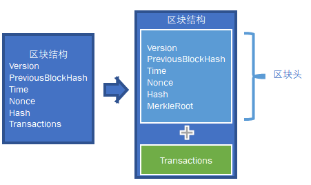
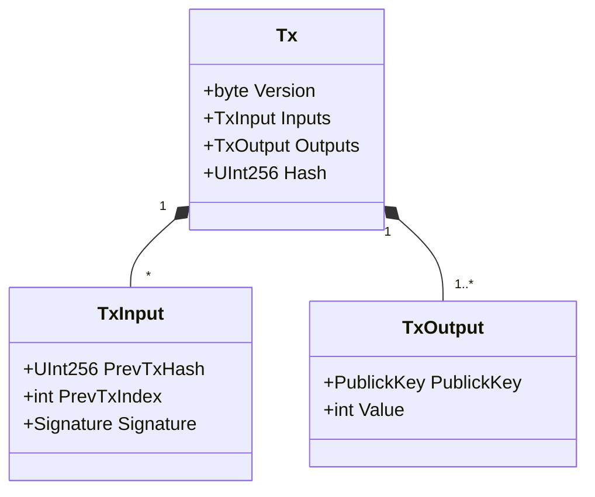

读书提示：本书[发布在此](https://book.uchaindb.com/)，具有更好的阅读体验。

# 交易的签名

## 区块结构

在上一章基本的区块链程序中，我们已经有过区块结构的定义，不过为了使得支持轻量客户端，
我们需要修改区块结构，将其分割开来，其中仅包含部分重要信息的部分被称为区块头，
区块头中的信息有限且长度固定，不管这个区块中包含了多少交易，每一个区块头的长度均为固定值，
这使得轻量客户端始终可以存储下所有的区块头，而轻量客户端存储了所有的区块头信息，
才使得轻量客户端可以轻量的正确执行简单交易验证，而不会受到恶意服务器节点的欺骗。

如下图所示，跟上一章相比，我们将Transactions字段单独存在于区块结构中，
而剩余字段以及一个新的MerkleRoot字段一同放到区块头中。



因此变更后，区块头中包含以下字段：

| 字段              | 描述             | 类型     |
| ---               | ---              | ---      |
| Version           | 版本号           | Byte     |
| PreviousBlockHash | 前一区块的哈希值 | UInt256  |
| Time              | 时间戳           | DateTime |
| MerkleRoot        | 默克尔树根       | UInt256  |
| Nonce             | 随机数           | UInt32   |
| Hash              | 本区块的哈希值   | UInt256  |

<!-- code:ClassicBlockChain/Entity/Block.cs -->

该表格中的除了本区块的哈希值以外的所有字段，均会被作为本区块的哈希值计算的基础数据，
故这些字段的任意一点变化均会导致本区块的哈希值的不同，
除了默克尔树根之外的字段已于上一章详细解释过，这里仅详细解释新增的默克尔树根字段：

**默克尔树根**。将本区块中的所有交易使用本章学习的哈希树结构进行构造，
并最终记录其树根的哈希值，即为默克尔树根。
鉴于哈希树可以通过构建部分哈希树来轻量级的验证一笔交易是否存在于该哈希树，
所以对于轻量客户端，仅需通过存储于客户端中默克尔树根便可以验证一笔交易是否存在于该区块中，
即恶意节点无法通过告知一个不存在的交易以欺骗客户端。
但值得注意的，恶意节点有可能告知客户端一笔实际存在的交易不存在，
客户端需要通过向多个全节点查询以确认没有被欺骗。

## 交易的结构

与上一章的程序相比，为了支持交易的签名，交易的输入输出结构发生了较大的变化，
不过交易本身仍旧是链式交易这件事情没有变化。



如上图所示，我们有三个类，下面分别进行详述。

首先是存储交易的主类：

| 字段     | 描述           | 类型       |
| ---      | ---            | ---        |
| Version  | 版本号         | Byte       |
| InputTxs | 输入交易列表   | TxInput[]  |
| Outputs  | 输出交易列表   | TxOutput[] |
| Hash     | 本交易的哈希值 | UInt256    |

<!-- code:ClassicBlockChain/Entity/Transaction.cs -->

该表格中的除了本交易的哈希值以外的所有字段，均会被作为本交易的哈希值计算的基础数据，
故这些字段的任意一点变化均会导致本交易的哈希值的不同，以下对每个字段进行详细解释：

**版本号**。与前一章的定义相同，不再赘述。

**输出交易列表**。作为本次交易的输出，每个输出交易列表项均包含接收者公钥和资金数量两个字段，
这每个输出交易均为可使用的交易，由可以使用该公钥对应私钥进行签名的用户进行使用。
任意一笔输出交易在整个区块链的生命周期内均只可使用一次，对于从未使用过的输出交易，
我们也称其为未使用的交易输出（UTXO）。

| 字段      | 描述       | 类型      |
| ---       | ---        | ---       |
| PublicKey | 接收者公钥 | PublicKey |
| Value     | 资金数量   | int       |

<!-- code:ClassicBlockChain/Entity/TxOutput.cs -->

**输入交易列表**。作为本次交易资金源头输入的未使用交易列表，每一个输出交易均为可被使用的交易，
而指向这笔输出交易的交易哈希值及输出交易序号便唯一的标记了一个可以使用的交易，
每个输入交易列表项便需要包含指向一笔未使用交易的交易哈希值及输出交易序号，
除此之外，创建此笔交易的用户还需要提供签名以证明自己拥有对前项输出交易的所有权。

| 字段        | 描述                 | 类型      |
| ---         | ---                  | ---       |
| PrevTxHash  | 未使用交易的哈希值   | UInt256   |
| PrevTxIndex | 未使用交易的输出索引 | int       |
| Signature   | 签名                 | Signature |

<!-- code:ClassicBlockChain/Entity/TxInput.cs -->

**本交易的哈希值**。将以上所有字段的数据作为哈希运算的基础数据，计算出本交易的哈希值，
但值得特别强调的是，区块链中所有的交易的哈希值都是不一样的，不会有重复的，
相同哈希值的交易会在验证步骤被当作重复交易去除掉。对于矿工的CoinBase交易，
因无输入，故需要对每笔交易使用不同的公钥，以确保该交易的哈希值唯一，为批量获得公私钥对，
本章后续章节会介绍一种实现方式——确定性钱包。

## 验证签名

```cs
private bool ValidateTx(Transaction tx)
{
    if (this.BlockChain.ContainTx(tx.Hash)) return false;
    if (this.BlockChain.ContainUsedTxs(tx.InputTxs)) return false;
    foreach (var intx in tx.InputTxs)
    {
        var output = this.BlockChain.GetTx(intx.PrevTxHash).Outputs[intx.PrevTxIndex];
        var verifyTx = new Transaction
        {
            Version = tx.Version,
            InputTxs = tx.InputTxs
                .Select(_ => new TxInput { PrevTxHash = _.PrevTxHash, PrevTxIndex = _.PrevTxIndex })
                .ToArray(),
            Outputs = tx.Outputs.ToArray(),
        };
        if (!this.signAlgo.Verify(new[] { Encoding.UTF8.GetBytes(verifyTx.HashContent) }, output.PublicKey, intx.Signature))
            return false;
    }
    return true;
}
```
<!-- code:ClassicBlockChain/Core/Engine.cs -->

