# 执行环境

## 虚拟机基础

### stack

定义
	仅在表头进行插入和删除操作的线性表
操作
	压栈push、出栈pop
特点
	后进先出LIFO(Last In First Out)

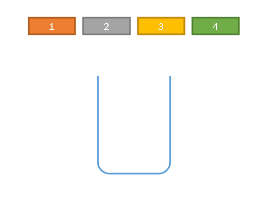

### P2pkh

锁定脚本(ScriptPubKey)
	DUP HASH160 <公钥哈希> EQUALVERIFY CHECKSIG
解锁脚本(ScriptSig)
	<签名> <公钥>
验证方式
	【解锁脚本+锁定脚本】一起放入栈虚拟机运行
	期望结果为“成功”（true）

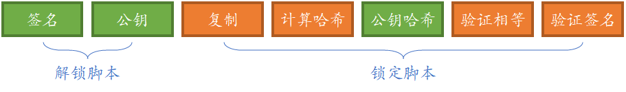

（点开以下动图详细了解这三个安全特性）

<!-- tabs:start -->

#### ** 准备 **

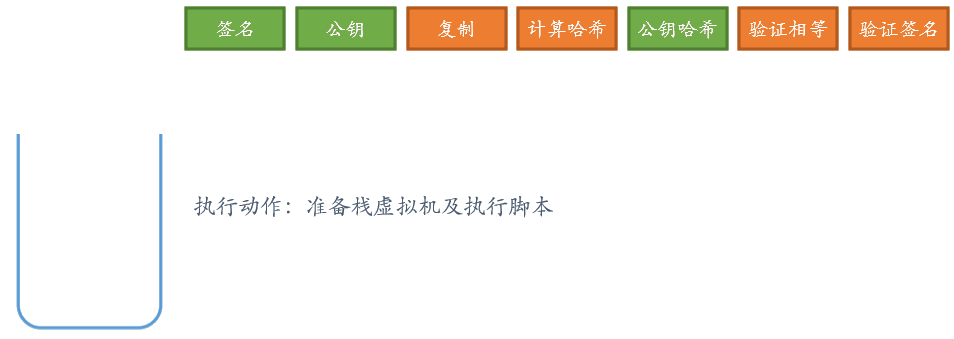


#### ** 签名 **

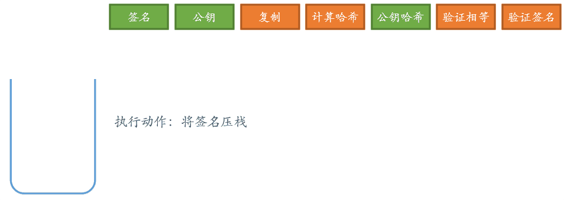


#### ** 公钥 **

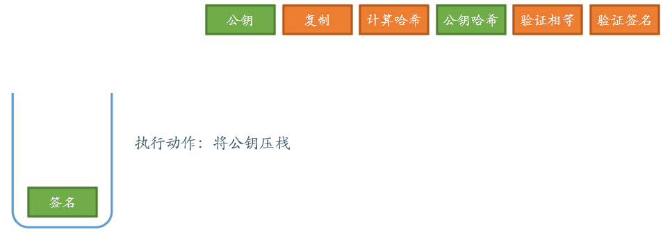


#### ** 复制 **

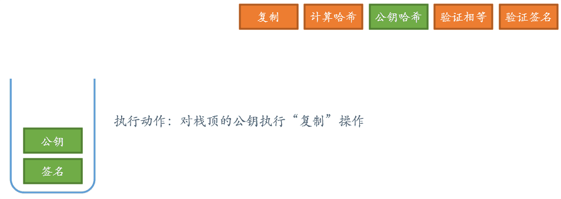


#### ** 计算哈希 **

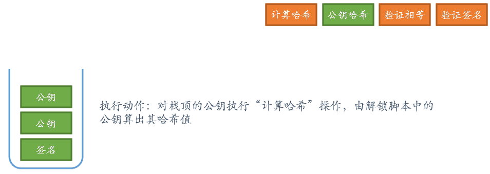


#### ** 公钥哈希 **

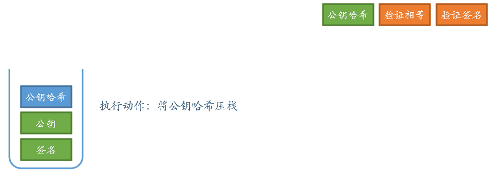


#### ** 验证相等 **

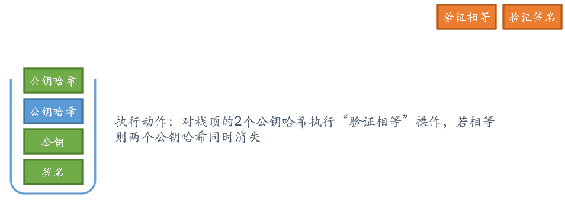


#### ** 验证签名 **

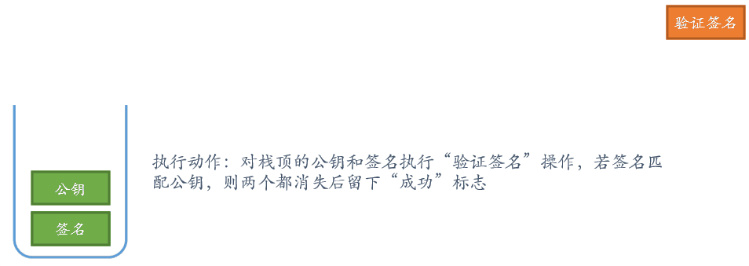


#### ** 验证结果 **

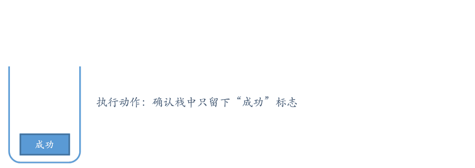


<!-- tabs:end -->


### forbid

比特币栈虚拟机被故意设计成图灵不完全
故所有验证都可以在可预测的时间内完成
对验证区块有威胁的操作符也被禁止使用

OP_CAT
OP_SUBSTR
OP_LEFT
OP_RIGHT
OP_2MUL
OP_2DIV
OP_MUL
OP_DIV
OP_MOD
OP_LSHIFT
OP_RSHIFT


## 操作指令

```cs
public enum OpCode : byte  
{  
    Object,  
    CheckSignature,  
}  
```
<!-- code:ClassicBlockChain/SmartContracts/OpCode.cs -->

## 栈指令类

```cs
public class ScriptToken   
{  
    public const string TOKEN_PREFIX = "OC_";  
    public bool IsOpCode { get => this.OpCode != OpCode.Object; }  
    public OpCode OpCode { get; set; } = OpCode.Object;  
    public string Object { get; set; }  
  
    public ScriptToken(object obj)  
    {  
        if (obj is OpCode opcode)  
        {  
            this.OpCode = opcode;  
        }  
        else if (obj is string str)  
        {  
            if (str.StartsWith(TOKEN_PREFIX))  
            {  
                this.OpCode = (OpCode)Enum.Parse(typeof(OpCode), str.Remove(0, TOKEN_PREFIX.Length));  
            }  
            else  
            {  
                this.Object = str;  
            }  
        }  
        else  
        {  
            this.Object = obj.ToString();  
        }  
    }  
  
    public string GetValue()  
    public static ScriptToken CreateToken(object obj)  
    public override bool Equals(object obj)  
    public override int GetHashCode()  
}  
```
<!-- code:ClassicBlockChain/SmartContracts/ScriptToken.cs -->

## 指令辅助类

```cs
public class UnlockScripts : ReadOnlyCollection<ScriptToken>  
{  
    public UnlockScripts(IList<ScriptToken> list)  
        : base(list)  
    {  
    }  
}  
```
<!-- code:ClassicBlockChain/SmartContracts/UnlockScripts.cs -->

```cs
public class LockScripts : ReadOnlyCollection<ScriptToken>  
{  
    public LockScripts(IList<ScriptToken> list)  
        : base(list)  
    {  
    }  
}  
```
<!-- code:ClassicBlockChain/SmartContracts/LockScripts.cs -->

```cs
public class WholeScripts : ReadOnlyCollection<ScriptToken>  
{  
    public WholeScripts(IList<ScriptToken> list)  
        : base(list)  
    {  
    }  
}  
```
<!-- code:ClassicBlockChain/SmartContracts/WholeScripts.cs -->

```cs
public static WholeScripts operator +(UnlockScripts us, LockScripts ls)  
    => new WholeScripts(us.Concat(ls).ToList());  
```
<!-- code:ClassicBlockChain/SmartContracts/UnlockScripts.cs -->

## 执行

  ```cs
public static T Evaluate<T>(ScriptToken[] tokens, Transaction transaction, ISignAlgorithm algorithm)  
{  
    var ret = Evaluate(tokens, transaction, algorithm);  
    if (typeof(T) == typeof(Boolean))  
    {  
        var s = ret.ToString().ToLower();  
        return (T)(object)(s == "true");  
    }  
  
    return (T)Convert.ChangeType(ret, typeof(T));  
}  
```
<!-- code:ClassicBlockChain/SmartContracts/Evaluator.cs -->

```cs
public static object Evaluate(ScriptToken[] tokens, Transaction transaction, ISignAlgorithm algorithm)  
{  
    var stack = new Stack<ScriptToken>();  
  
    foreach (var token in tokens)  
    {  
        if (!token.IsOpCode)  
        {  
            stack.Push(token);  
            continue;  
        }  
  
        switch (token.OpCode)  
        {  
            case OpCode.CheckSignature:  
                {  
                    if (!stack.CanPop()) return false;  
                    var pubKey = PublicKey.ParseBase58(stack.Pop().GetValue());  
                    if (!stack.CanPop()) return false;  
                    var sig = Signature.ParseBase58(stack.Pop().GetValue());  
                    var ret = algorithm.Verify(new[] { (byte[])transaction.GetLockHash() }, pubKey, sig);  
                    stack.Push(ScriptToken.CreateToken(ret));  
                    break;  
                }  
            default:  
                break;  
        }  
    }  
  
    if (!stack.CanPop()) return false;  
    return stack.Pop().GetValue();  
}  
```
<!-- code:ClassicBlockChain/SmartContracts/Evaluator.cs -->

```cs
public static bool TryExecuteAsync(this WholeScripts scripts, Transaction trans, ISignAlgorithm signAlgorithm = null)  
{  
    signAlgorithm = signAlgorithm ?? new ECDsaSignAlgorithm();  
    var eval = Evaluator.Evaluate<bool>(scripts, trans, signAlgorithm);  
    return eval;  
}  
```
<!-- code:ClassicBlockChain/SmartContracts/TokenScriptExtension.cs -->

```cs
public static bool CanPop(this Stack<ScriptToken> stack)  
{  
    return stack.Count > 0;  
}  
```
<!-- code:ClassicBlockChain/SmartContracts/TokenScriptExtension.cs -->

