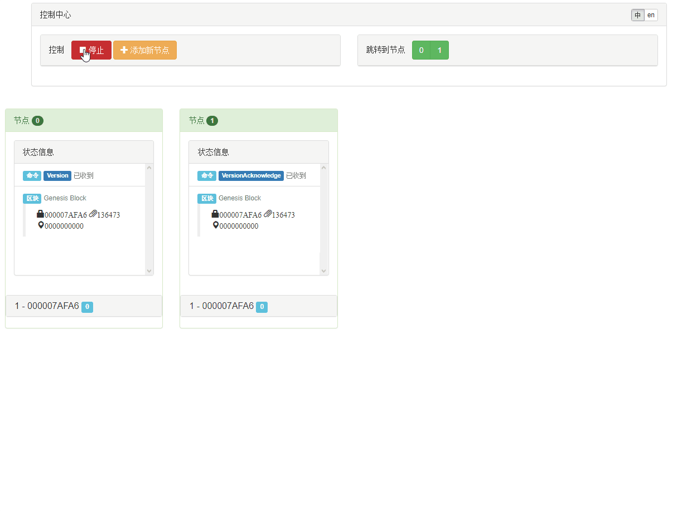
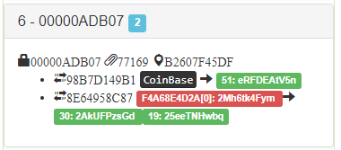
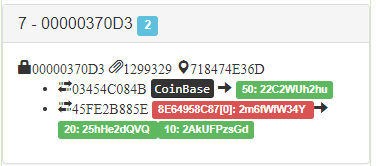
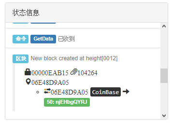
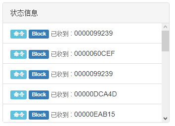

读书提示：本书[发布在此](https://book.uchaindb.com/)，具有更好的阅读体验。

# 古典区块链的实现

> 区块链因比特币而生

从2008年比特币的白皮书发布到现在已经过去了十个多年头了，区块链技术本身也因其簇拥者众多，
迅速的进行多次的更新迭代，对于区块链时代的划分，也有着非常多不同的称呼，
例如古典区块链、区块链1.0、第一代区块链等等。

本书的第一部分，选取比特币作为参考，编程实现这一古典的区块链。
通过这一部分的学习，我们应该能够回答以下问题：

- 一个基本的区块链程序应该包含哪些组成部分？
- 钱包程序与区块链程序是什么样的关系？
- 轻量客户端是什么，以及为什么非常重要？
- 分布式网络如何达成共识的？
- 智能合约是什么，何为可编程数字货币？

#### 演示

通过本书第一部分内容的讲解，你将能够亲自编写和以下演示程序一样效果的区块链程序。
具备标准的区块链程序的方方面面。

该演示所演示的内容如下：

* 启动程序，并初始化两个节点；
* 两个节点各自进行挖矿操作；
* 任何一个节点挖矿成功，立即发出广播；
* 节点收到新区块的消息后，立即放弃自己已有区块的挖矿操作，投入到最长链的挖矿中；
* 当已有节点已经运行了一段时间后，添加新的节点；
* 新节点一边进行自己的挖矿操作，一边等待广播
* 新节点收到广播后，放弃自己已经挖到的区块，投入到最长链的挖矿中；
* 停止演示后，查看每个区块中的交易信息，可见所有节点是同步的；

以下是部分细节信息的展示：

| 含有交易费的交易示例    | 不含交易费的交易示例    |
| :-:                     | :-:                     |
|  |  |

| 新区块创建时的状态记录  | 收到新区块时的状态记录  |
| :-:                     | :-:                     |
|  |  |

<!-- code:ChainStudy.sln;branch:1_5_smart_contracts -->

